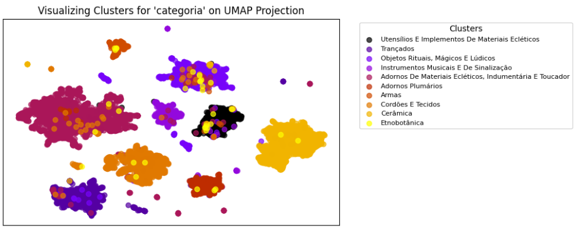
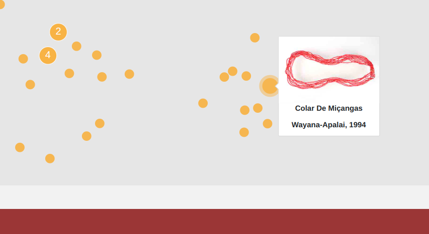

# Clustering Experiments

This page outlines the clustering experiments we conducted, ranging from simple baseline methods to more sophisticated grouping techniques. Here, you will find details on the approaches we implemented, insights into what worked well, reflections on the challenges we encountered, and conclusions we can draw from all that.

## The Baselines

Before applying advanced machine learning techniques, we began by exploring fundamental aspects of our data. Instead of immediately relying on algorithms, we first sought to understand what insights could be directly extracted from the dataset and how domain knowledge from museum specialists could be integrated. Establishing these baselines was crucial for two reasons:

1. **Comparing our clusters to existing knowledge:** This helped evaluate how well our models captured essential patterns in the collection.

2. **Identifying knowledge gaps:** By analyzing our clustering results, we could pinpoint connections between items and communities that were previously not identified.

This analysis extends beyond traditional quantitative measures, such as embedding space distribution and clustering algorithm performance. Instead, it also focus on the qualitative aspects - evaluating whether the clusters align with meaningful patterns within the collection and how effectively they reveal new insights.

### Random Orthonormal Projections

To establish these baselines, we first explored clustering categorical features by mapping them into a higher-dimensional space. We couldn't, however, assume any inherent relationships between categories, making it crucial to treat clusters as equidistant. To enforce that, we applied *random orthonormal projections*. For each feature (in our expetiment `categoria` with 10 classes and `tipo_de_materia_prima` with 4 classes), we generated a random orthonormal matrix, ensuring every category had a unit vector, all of them orthogonal to one another. For multi-category features, we summed categories' vectors when a datapoint belonged to more than 1 category. This produced "high-dimensional" representations of data that we could use for clustering.

While theoretically interesting, this approach naturally failed. The resulting space was highly sparse, leading to poor clustering and later visualization. Even before clustering, lower-dimensional projections showed no clear groupings or symmetry.

To better preserve distances, we tested two projection techniques:

- **MDS:** Effective in low dimensions (so 14 shouldn't be a problem) and optimizes for distance preservation.

- **TriMap:** Suitable for higher-dimensional spaces while maintaining global structure.

Despite slight improvements with TriMap, neither method yielded meaningful clusters.

     
    

    Plot showing <i>MDS</i> and <i>TriMap</i> 2D projections from random orthonormal vectors for 2 (concatenated) features (14 dimensions).
     

### Categorical Clustering

After the failure of random orthonormal projections, we returned directly to categorical clustering. We used *multi-hot encoding* to transform features with multiple category assignments into binary vectors. Then, we applied *K-Modes*, a clustering algorithm designed for categorical data that measures dissimilarity based on category mismatches instead of Euclidean distance.

Using `categoria` and `tipo_de_materia_prima` again, we found that 16 clusters provided the best balance, slightly exceeding the sum of individual category counts (14) - not suggesting an overestimation but still accounting for possible correlations between categories across the features. While this approach prevented cluster assignment issues through the direct use of the categories, we still had a very sparse feature space and visualization remained challenging.

- **t-SNE** failed, producing unnatural circular patterns due to its KL-Divergence minimization on (sparse) categorical data.

- **UMAP** struggled, as the sparse feature space violated its assumption of an underlying manifold, leading to a chaotic point cloud.

- **TriMap** performed best, forming a few identifiable clusters. However, some clusters split across multiple areas - necessary for preserving some kind of equidistance between all clusters in 2D. Despite this improvement, visualization remained unclear.

     
    

    Plot showing <i>t-SNE</i>, <i>UMAP</i>, and <i>TriMap</i> 2D projections from categorical vectors for 2 features (14 dimensions).
     

### Basic Feature-Based Clustering  

Due to the failures of the previous methods, we opted for a simpler approach, directly using only the most well-defined and easily visualized feature as baseline: `tipo_de_materia_prima`. This feature has three meaningful categories - *animal*, *vegetal*, and *mineral*. A fourth category (*sintetico*) exists, but no data points fall into this group. Items can also belong to multiple categories.

To represent clusters in 2D, we used a triangle representation:

- Each vertex represents one category (*animal*, *vegetal*, or *mineral*).

- Midpoints between vertices represent items that belong to two categories (each one of the closest vertices).

- Items that belong to all three categories are placed in the center of the triangle.

Since each category would otherwise collapse into a single point, making visualization difficult, we added 2D Gaussian noise to create a point-cloud effect.

     
    

    Plot showing clusters of <code>tipo_de_materia_prima</code>.
     

### Specialist Taxonomy

The ideal baseline for our models, of course, would be a well-established, specialist-curated taxonomy - one that mapped out all indigenous communities and their relationships through deep cultural and historical research. As a proxy, we initially considered using the indigenous language family tree, since language is often one of the clearest indicators of cultural proximity. However, this tree is incomplete, fragmented, and not available in a computationally structured format that could be easily integrated into our modeling pipeline.

We also reached out to museum experts in indigenous cultures across Brazil, hoping to find a more formal structure. What we discovered, however, was that while specialists exist for (nearly) every documented community, their expertise is often highly localized. Each expert typically focuses on a specific group, region, or cultural context, and there is no centralized taxonomy that connects these communities in a unified or comparative way.

That realization shifted our perspective entirely. We were initially focused on building models that would need validation against an established reference, but it turned out that such a reference doesn’t exist in the way we imagined. Instead, our work has the potential to offer a new kind of tool: something that can help indigenous scholars and museum professionals uncover patterns, connections across communities that may not have been formally documented before.

Rather than aligning our models to a fixed taxonomy, we began to see the platform as a way to co-create knowledge - a starting point for exploring community relationships through new lens. The point clouds, embeddings, and search features we'll discuss in the following sections provide a novel way of navigating and comparing cultural artifacts, suggesting possible affinities that can then be further examined and validated by specialists.

In the end, the "baseline" we were searching for was not something pre-existing, but something that this very work could help build: a dynamic, evolving foundation to support future taxonomies, guided by both technology and the communities that understand these cultural expressions best.

## Clustering Through Machine Learning

### Image-Based Clustering

This section delves into the technical aspects of one of our machine learning approaches: using image-based clustering to group objects, aiming to understand how they connect through visual similarities. The results of this process serve two main purposes:

1. **Enhancing collection navigation:** By clustering visually similar objects together, we create an interactive and intuitive way for users to explore the collection. Similar objects will be positioned in close proximity within our final projection, allowing users to navigate different “micro-universes” of the collection, observe category transitions, and explore relationships between items.  

2. **Uncovering latent relationships:** Our models help to reveal previously undocumented connections between groups of objects or cultural communities. This is particularly valuable for researchers studying indigenous peoples, as it provides insights into shared artistic or manufacturing traditions. Given the lack of centralized taxonomies for indigenous groups in Brazil, our tool could serve as a pivotal resource for broader ethnographic studies in the country.  

To implement this, we use image feature extractors to project background-removed images (see [dataset documentation](https://github.com/Luizerko/indigenous_clusters_and_communities/tree/main/DATASET.md) for details) into high-dimensional space. We then apply dimensionality reduction techniques to visualize the clusters.

Beyond simple projections, we experimented with fine-tuning models to improve item dispersion and enable subdivision by specific attributes (e.g., `povo` or `categoria`). This allows users to explore both individual item neighborhoods and broader categorical relationships within the dataset. 

We now proceed to describe the technical pipelines implemented, report the obtained results and show some of the generated images for clarity. For this stage, we used two main feature extraction models, both based on transformers. Transformer-based architectures are currently state-of-the-art for feature extraction, as they leverage pretrained backbones with the best results when optimized on large-scale classification tasks (such as ImageNet21K in our case).

#### ViT Base (Patch 16x16)

We started with the *ViT Base* model with 16x16 patches, trained on *ImageNet21K*, available on [Hugging Face](https://huggingface.co/google/vit-base-patch16-224-in21k). Although no longer cutting-edge, *ViT* remains a foundational model in the field and serves as a solid reference point for transformer-based architectures. Many state-of-the-art models, including the next one we discuss (*DINOv2*), build upon it.

For preprocessing, we resized images to 224x224 (cropping if larger in any dimension and bilinear interpolation if smaller), then normalized them using a mean of 0.5 and a standard deviation of 0.5 for all channels, following the model’s preprocessing pipeline.

Using only the pretrained backbone, we projected the images into a high-dimensional space and applied dimensionality reduction techniques to generate 2D visualizations for the interactive tool. We tested three different techniques:

- **TriMap:** Poor results, with minimal data dispersion and poor visual separation.

- **t-SNE:** Produced an entangled, chaotic cloud with no clear clusters.

- **UMAP:** Successfully created a meaningful manifold, capturing structure with the vanilla pretrained model and groupings when fine-tuned (as discussed later).  

   
  
  

    2D projections using <i>TriMap</i>, <i>t-SNE</i>, and <i>UMAP</i> with the vanilla pretrained <i>ViT</i> model. <i>UMAP</i> (right) was the best method in providing meaningful spread of the data, which later improved with fine-tuning.
  

   

The resulting projection reveals a dense point cloud due to the lack of a specific fine-tunning category. However, a continuous manifold emerges, where visually similar objects are positioned close together. This reflects the model’s ability to capture diverse visual similarities, including shape, colors, texture and details. This manifold alone offers a unique and interactive way to navigate the collection. But what happens when we introduce more structured knowledge into the data?

To refine clustering, we performed fine-tuning using the `povo` and `categoria` features, aiming for semantically distinct object groupings. This allows for categorical exploration and a more nuanced understanding of relationships between indigenous communities and their artistic traditions.

For that, we added a classification head to the network’s backbone - a single linear layer with 768-dimensional output from the backbone as the input size and the number of classes in the chosen feature as the output size. While common fine-tuning methods involve adding a small fully connected network, *ViT* fine-tuning is typically performed by adding a single linear layer at the top of the network. This approach is supported by section **3.1** of the [*ViT* original paper](https://ar5iv.labs.arxiv.org/html/2010.11929) and section **3.2** of [this paper](https://openreview.net/pdf?id=4nPswr1KcP), which explores *ViT* training and fine-tunning strategies.

##### Fine-Tunning Models

We fine-tuned several models until convergence (normally 20 to 30 epochs) to achieve the best possible results and assess the effectiveness of each adjustment we were implementing. Going into the implementation details, the dataset was split into 80% training, 10% validation, 10% test, and the original collection contained approximately 11,000 images.

For each model, we tracked:  
  - **Loss**  
  - **Validation accuracy**  
  - **Average class precision**  
  - **Average class recall**  

All models were fine-tuned on a 8GB RTX 4070 until convergence (typically between 20 and 30 epochs) using:  
- **Adam optimizer** (with weight decay)  
- **Cross-entropy loss** (either with or without weights)  
- **Early stopping** (1% accuracy tolerance, 3-iteration patience)  
- **Five runs per model** (for mean and standard deviation analysis)  

Most models, however, were not fine-tuned directly on the original dataset due to severe class imbalance for `povo` and, to a lesser extent, `categoria`. To address this, we developed a rebalancing pipeline, which significantly improved model performance.  

For `povo`, we started by understanding the distribution. We analyzed the quantiles of class sizes. `povo` contains 187 classes, but 25% of these (~47 classes) have only 4 images - insufficient for training. Even after removing these 25% least populated classes, around 99% of the dataset remains intact. We ultimately removed 75% of the least populated classes (~138 classes), keeping only classes with more than 65 images, preserving around 85% of the original data.

Despite filtering, class sizes still varied significantly. To address this we performed a class median analysis: classes with more than 2 times the median image count were labeled as *majority* classes, and others were labeled as *minority* classes. After that we started data augmentation for minority classes through random horizontal flips, random vertical flips and random Gaussian blur. For the majority classes, in turn, we randomly (under)sampled images to match minority class sizes. Notice, however, that only augmenting minority classes could introduce a bias where the model differentiates minority/majority classes based on artificially added noise. Thus, we applied stronger undersampling to majority classes and then also augmented them.  

   
  
  
  

    Class distribution before and after applying the rebalancing pipeline for <code>povo</code> (left) and <code>categoria</code> (right). The adjustments - filtering, augmentation and undersampling - led to more uniform class representation during training.
  

   

Even after balancing, class disparities remained though. Because of that, we assigned weights inversely proportional to the amount of data the class had, ensuring equal contribution during training.  

For `categoria`, the procedure was nearly identical to `povo`, with one key difference: only one class (*"etnobotânica"*) was significantly underrepresented. Hence, instead of a full quantile study, we filtered this single class. The remaining balancing steps followed the same augmentation, undersampling, and weight adjustment process.

The tables below summarizes the parameters for different models and the corresponding quantitative results.

| Dataset | Learning Rate | Weight Decay | Frozen Layers (%) | Weighted Loss | Test Accuracy (%) | Avg. Precision | Avg. Recall | Avg. Precision on Selected Classes | Avg. Recall on Selected Classes | 
|-|-|-|-|-|-|-|-|-|-|
| Original | 5e-5 | 2e-6 | 0 | False | 68.32 ± 1.52 | 0.29 ± 0.02 | 0.26 ± 0.02 | 0.58 ± 0.01 | 0.62 ± 0.01 |
| Balanced | 2e-5 | 2e-6 | 0 | True | **70.99 ± 0.73** | - | - | **0.71 ± 0.02** | **0.69 ± 0.02** |
| Balanced | 2e-5 | 2e-6 | 50 | True | <ins>70.04 ± 1.75</ins> | - | - | <ins>0.69 ± 0.02</ins> | <ins>0.65 ± 0.03</ins> |
| Balanced | 2e-5 | 2e-6 | 80 | True | 67.48 ± 1.13 | - | - | 0.64 ± 0.01 | 0.62 ± 0.01 |

  Parameters and results for <i>ViT</i> models fine-tuned on <code>povo</code>.

| Dataset | Learning Rate | Weight Decay | Frozen Layers (%) | Weighted Loss | Test Accuracy (%) | Avg. Precision | Avg. Recall | Avg. Precision on Selected Classes | Avg. Recall on Selected Classes | 
|-|-|-|-|-|-|-|-|-|-|
| Original | 1e-5 | 2e-6 | 0 | False | <ins>87.60 ± 0.81</ins> | 0.78 ± 0.01 | 0.76 ± 0.01 | <ins>0.86 ± 0.02</ins> | 0.84 ± 0.01 |
| Balanced | 3e-6 | 1e-6 | 0 | True | **88.64 ± 1.53** | - | - | **0.88 ± 0.01** | **0.85 ± 0.01** |
| Balanced | 3e-6 | 1e-6 | 50 | True | 87.43 ± 1.37 | - | - | <ins>0.86 ± 0.02</ins> | **0.85 ± 0.02** |
| Balanced | 3e-6 | 1e-6 | 80 | True | 86.30 ± 1.30 | - | - | 0.84 ± 0.02 | 0.83 ± 0.02 |

  Parameters and results for <i>ViT</i> models fine-tuned on <code>categoria</code>.

Before diving into the interpretation of these results, it's important to clarify a few details about the evaluation process. The metrics for average precision and recall in the original dataset case for `povo` are significantly lower than in the balanced case - not only because of model performance, but also due to the vast number of classes included. The `povo` column includes nearly 200 communities, many of which have very little data, making accurate classification extremely challenging. To make the comparison fair, we introduced two extra columns: *Avg. Precision on Selected Classes* and *Avg. Recall on Selected Classes*. These are computed only on the subset of classes retained after rebalancing, allowing for a more direct comparison between models fine-tuned on the original dataset and those fine-tuned on the balanced version. This helps isolate the effects of balancing and training strategy, instead of having the metric dominated by dozens of poorly represented classes.

These results highlight a few important trends. First, models fine-tuned on the balanced datasets consistently outperformed those fine-tuned on the original, imbalanced data - both in terms of overall accuracy and especially in precision and recall for selected classes. This underscores the importance of dataset curation and balancing when working with real-world, imbalanced collections.

Second, we observed that freezing layers negatively impacted performance, particularly when freezing more than 50% of the model. This suggests that the generalization capacity of the pre-trained *ViT* model is limited, at least when it comes to our specific dataset, and that more extensive fine-tuning is required for the model to adapt meaningfully to our task. This behavior differs from what we’ll later observe with another architecture, and we’ll explore that in the following section.

Looking beyond the raw numbers, it’s also helpful to consider the embedding spaces produced by these models. When we project the full dataset (especially for `povo`) into 2D using *UMAP*, the spread of points appears noisy and unstructured at first glance. This lack of global structure is expected: most classes were filtered out due to insufficient data and never seen during training. However, local structures do emerge. When filtering the projection to highlight only a single community, items for that community tend to be grouped closely together, validating that the model learns consistent visual signatures for groups it has seen enough of. In some cases, we can also see visual affinities between specific communities, hinting at stylistic or material overlaps - something that the platform enables users to explore dynamically.

The story is quite different for `categoria`. Here, the spread is much cleaner, and we can clearly see well-defined clusters for most categories. These clusters often sit close to others with which they share visual or material similarities. Interestingly, when inspecting the edges of clusters, we see a smooth transition: the items on the edge of one category often resemble those on the nearest edge of a neighboring cluster. This is a proof of a meaningful data manifold, where inter-class similarity is encoded naturally within the latent space. Within each cluster, there's also a strong internal structure - items flow from simpler, more typical examples to more complex or ambiguous ones along continuous directions. One notable exception is the class *etnobotânica*, which was not retained during fine-tuning due to lack of data. As expected, its samples are scattered across all clusters, showing weak cohesion but also ratifying the model’s ability to project items based on their visual similarities.

   
  
  
  

    Embedding spaces generated by the <i>ViT</i> model fine-tuned on <code>povo</code> (left) and <code>categoria</code> (right). While <code>povo</code> shows limited global structure due to class imbalance and filtering, <code>categoria</code> exhibits well-defined clusters and a coherent manifold, with smoother transitions and internal organization.
  

   

Going even beyond, one of the most exciting outcomes of these models - especially the ones fine-tuned for `categoria` - was their ability to offer qualitative insights into the collection. For example, in analyzing projections, we discovered that necklaces from the *Mayongong* people display a broad color diversity, with several items featuring vibrant palettes not commonly seen for other groups. Intriguingly, some of these color schemes overlapped with those found in *Kamayurá* and *Kuikuro* necklaces, suggesting possible shared stylistic influences or material sources.

Another compelling observation was that both *Kamayurá* and *Kuikuro* necklaces frequently use a large lace to tie them, in contrast to the more commonly seen smaller wrap-style lace in other communities. The model's grouping behavior helped surface this design pattern, which might otherwise have been missed. We also noticed similarities between *Wajãpi* and *Wayana-Apalai* necklaces, especially in their color and layout, highlighting potential cultural or artisanal connections.

   
  
  
  
  

    Visual similarities between necklaces from the <i>Mayongong</i> (left), <i>Kamayurá</i> (center), and <i>Kuikuro</i> (right) communities. The model highlighted overlapping color palettes between all and distinctive tie styles between the last two, suggesting possible shared stylistic or material influences.
  

   

   
  
  
  

    Necklace designs from the <i>Wajãpi</i> (left) and <i>Wayana-Apalai</i> (right) communities. The model's clustering revealed subtle yet consistent visual parallels in color choice and layout, indicating potential artisanal or cultural connections.
  

   

Furthermore, the model proved to be a valuable tool for identifying outliers. For instance, we detected a ceramic piece from the *Waurá* community that was mistakenly labeled as belonging to the *trançado* category. It appeared embedded within the ceramic cluster in our embeddings space though, indicating a strong visual similarity to other ceramics despite its incorrect categorization. This kind of flagging can help curators re-examine potential misclassifications and uncover hidden relationships across items and communities.

   
  
  
   
  

    Example of a typical ceramic piece (left) and the misclassified outlier (right), originally labeled as <i>trançado</i>. Despite the incorrect label, the model placed it within the ceramic cluster in the embedding space, showcasing its potential to surface visually consistent but categorically inconsistent items.
  

   

These examples reinforce the potential of these models not just for classification of new items, but as analytical tools for uncovering patterns, highlighting inconsistencies, and supporting more nuanced interpretations for such a complex cultural dataset.

In addition to the previously mentioned models, we developed a multi-head model to explore the semantics of the network’s image projections when optimizing both features simultaneously. We implemented two classification heads - one for `povo` and another for `categoria` - with the loss being the weighted average of both losses.

Balancing the dataset was even more challenging in this case, as optimizing for one feature could disrupt the other. Joint distribution balancing was impractical due to the vast number of classes and because of the even worse joint-class imbalance, with little correlation between `povo` and `categoria`. Ultimately, we used the previously filtered classes for both features and initially balanced only for `povo`. This approach had minimal impact on `categoria`, which was already less imbalanced and not a major issue.

The table below summarizes the parameters for different head weights and the corresponding quantitative results.

| Learning Rate | Weight Decay | Head Weights (`povo`/`categoria`) | `povo` Head Test Accuracy (%) | `povo` Head Avg. Precision on Selected Classes | `povo` Head Avg. Recall on Selected Classes | `categoria` Head Test Accuracy (%) | `categoria` Head Avg. Precision on Selected Classes | `categoria` Head Avg. recall on Selected Classes |
|-|-|-|-|-|-|-|-|-|
| 1e-5 | 3e-6 | 50/50 | **71.38 ± 1.29** | **0.72 ± 0.02** | **0.68 ± 0.02** | 88.16 ± 0.59 | 0.86 ± 0.01 | 0.85 ± 0.02 |
| 1e-5 | 3e-6 | 70/30 | <ins>71.16 ± 1.86</ins> | **0.72 ± 0.02** | **0.68 ± 0.02** | <ins>89.26 ± 1.20</ins> | **0.89 ± 0.01** | **0.88 ± 0.02** |
| 1e-5 | 3e-6 | 30/70 | 70.28 ± 0.95 | 0.69 ± 0.01 | **0.68 ± 0.01** | **89.40 ± 1.09** | **0.89 ± 0.02** | <ins>0.87 ± 0.02</ins> |

  Parameters and results for multi-head <i>ViT</i> models fine-tuned on both <code>povo</code> and <code>categoria</code>. The columns <i>Dataset</i>, <i>Frozen Layers (%)</i>, <i>Weighted Loss</i>, <i>Avg. Precision</i> and <i>Avg. Recall</i> are not found in this table because we fine-tuned all models with the same (balanced) dataset, no frozen layers, always with weighted loss for both heads and only on the selected categories.

Training the model in a multi-head configuration resulted in small but consistent performance improvements over the single-task baselines. Comparing the best multi-head models to the best single-head models fine-tuned on the balanced dataset (no frozen layers), we see slightly higher accuracy and better precision/recall scores for both heads. This indicates that the model is able to leverage shared representations across tasks, enriching its internal features and learning complementary patterns from both `povo` and `categoria` labels.

It is worth noting, however, that the gain is relatively modest. This likely reflects the greater complexity of the `povo` task, which still suffers from data scarcity and class imbalance, even in the rebalanced version. Additionally, optimizing for both heads simultaneously introduces a trade-off, where improvements on one head may slightly constrain the other. Even so, the ability to train a single unified model for both classification tasks is advantageous for efficiency and introduces a new type of embedding space - one that theoretically captures combined semantics from both labels.

When examining the embedding space of the multi-head model, we see that it still struggles to separate `povo` classes clearly. The diversity and number of community labels, combined with limited examples for each, make global structure difficult to establish regardless of jointly using another label. The spread remains somewhat diffuse, with most points forming an indistinct cloud. However, it is encouraging that local clusters for `categoria` do emerge, even under this joint training regime. These clusters reflect the more structured and visually consistent nature of the `categoria` labels, as well as their stronger representation in the dataset.

This behavior reinforces previous observations: `categoria` benefits from greater cohesion and clearer visual boundaries, which translates into more structured embeddings, even when learned alongside a noisier signal like `povo`. Meanwhile, `povo` continues to be more challenging, but not without value, especially when investigating local patterns and visual similarities between communities.

   
  
  

    Embedding space of the multi-head <i>ViT</i> model fine-tuned on both <code>povo</code> and <code>categoria</code> and colored based on <code>categoria</code>. Despite the diffuse spread for <code>povo</code>, clearer cluster structures for <code>categoria</code> can still be observed, demonstrating that joint training can retain meaningful representations for visually coherent classes.
  

   

#### DINOv2

After exploring the performance of the *ViT* architecture, we moved on to a more modern model (*DINOv2*) to evaluate its potential and investigate how a self-supervised backbone might differ in both quantitative results and visual embedding structure. *DINOv2* has been shown to generalize well across multiple visual tasks without requiring large-scale supervised fine-tuning, making it a promising candidate for clustering goals.

Unlike *ViT*, which is trained in a supervised manner, *DINOv2* is pre-trained using a self-supervised learning objective based on knowledge distillation. It uses a teacher-student setup where the student model learns to match the output of a (slowly evolving non-gradients based) teacher model across multiple augmented views of the same image. This allows *DINOv2* to train with much more data (around 10 times more than ViT) and learn more robust semantic visual representations that generalize well across downstream tasks.

We used the base version of *DINOv2* (available on [Hugging Face](https://huggingface.co/facebook/dinov2-base)) and applied a similar preprocessing pipeline to that used with *ViT*, but with minor adjustments: images were resized so that the shorter side was 256 pixels, then center-cropped to 224×224, and normalized using the standard *ImageNet* statistics (`[0.485, 0.456, 0.406]` means and `[0.229, 0.224, 0.225]` standard deviations).

Like before, we extracted embeddings using the pretrained backbone and projected them into 2D using the *UMAP* technique, which had previously shown the best performance in capturing meaningful structure. Even in its vanilla form, *DINOv2* generated a smooth and semantically rich manifold, offering a compelling visual spread where visually similar objects naturally clustered together.

To better structure this space semantically, we fine-tuned *DINOv2* using both `povo` and `categoria` as classification targets again. As with *ViT*, we added a single linear classification head to the model - taking the 768-dimensional output from the backbone and projecting it to the number of target classes. This simple architecture was chosen to ensure a fair comparison to the *ViT* models we fine-tuned.

##### Fine-Tunning Models

The tables below present results from fine-tuning *DINOv2* models on both `povo` and `categoria`, using similar experimental setups as before.

| Dataset | Learning Rate | Weight Decay | Frozen Layers (%) | Weighted Loss | Test Accuracy (%) | Avg. Precision | Avg. Recall | Avg. Precision on Selected Classes | Avg. Recall on Selected Classes | 
|-|-|-|-|-|-|-|-|-|-|
| Original | 1e-6 | 3e-7 | 0 | False | 62.73 ± 0.62 | 0.23 ± 0.01 | 0.20 ± 0.01 | 0.53 ± 0.02 | 0.52 ± 0.01 |
| Balanced | 1e-6 | 3e-7 | 0 | True | 71.46 ± 1.13 | - | - | 0.70 ± 0.01 | 0.67 ± 0.01 |
| Balanced | 1e-6 | 3e-7 | 50 | True | <ins>73.45 ± 1.38</ins> | - | - | <ins>0.72 ± 0.02</ins> | <ins>0.70 ± 0.03</ins> |
| Balanced | 1e-6 | 3e-7 | 80 | True | **74.70 ± 1.24** | - | - | **0.74 ± 0.03** | **0.71 ± 0.01** |

  Parameters and results for <i>DINOv2</i> models fine-tuned on <code>povo</code>.

| Dataset | Learning Rate | Weight Decay | Frozen Layers (%) | Weighted Loss | Test Accuracy (%) | Avg. Precision | Avg. Recall | Avg. Precision on Selected Classes | Avg. Recall on Selected Classes | 
|-|-|-|-|-|-|-|-|-|-|
| Original | 3e-7 | 1e-7 | 0 | False | 86.60 ± 1.44 | 0.80 ± 0.06 | 0.78 ± 0.04 | 0.84 ± 0.03 | 0.83 ± 0.02 |
| Balanced | 3e-7 | 1e-7 | 0 | True | <ins>90.21 ± 1.22</ins> | - | - | **0.87 ± 0.02** | **0.88 ± 0.02** |
| Balanced | 3e-7 | 1e-7 | 50 | True | 89.90 ± 0.88 | - | - | **0.87 ± 0.01** | 0.87 ± 0.02 |
| Balanced | 3e-7 | 1e-7 | 80 | True | **90.52 ± 0.64** | - | - | **0.87 ± 0.01** | **0.88 ± 0.01** |

  Parameters and results for <i>DINOv2</i> models fine-tuned on <code>categoria</code>.

For `povo`, we observed that *DINOv2* struggled more than *ViT* on the original, imbalanced dataset, achieving lower accuracy and weaker recall and precision. However, it benefited more dramatically from the rebalancing step. Once fine-tuned on the balanced dataset, *DINOv2* not only caught up with *ViT*’s performance, it surpassed it. The model reached a test accuracy of nearly 4 points higher than *ViT*’s best result on the same task. Similarly, the precision and recall scores also improved.

An interesting trend emerged when we introduced layer freezing. Unlike *ViT*, where freezing harmed performance, *DINOv2* models benefited from freezing a significant portion of their layers. With 80% of the layers frozen, we achieved the best results on `povo`. This strongly suggests that *DINOv2*'s early layers encode features that generalize more effectively, and that the model can adapt well to our dataset with minimal fine-tuning - focusing only on higher-level representations. This is a notable distinction from *ViT*, where full fine-tuning was important to achieve the best results.

For `categoria`, *DINOv2* also achieved the highest accuracy overall. Precision and recall did not follow as much, in the sense that we did not see results getting much better than the ones for *ViT*, but still either similar or slightly better. In general, these improvements reinforce the idea that *DINOv2* was better equipped to extract meaningful visual patterns in categories for our data.

However, despite these promising results, the visual projections generated on top of *DINOv2* did not improve proportionally. When analyzing the 2D embeddings of the entire dataset, the clusters were not always more distinct or interpretable than those produced by *ViT*. In fact, while *DINOv2* captured a broader and smoother spread of the collection in its raw, vanilla embedding, grouping behaviors were generally clearer in the *ViT* model. As a result, we made a deliberate trade-off in our platform design: we chose to use *ViT*-based projections for `povo` and `categoria`, where grouping was more distinct.

   
  
  

      Comparison between the projected embedding spaces of <i>ViT</i> and <i>DINOv2</i> models single-task fine-tuned both on <code>povo</code> and <code>categoria</code>.
  

   

This decision is somewhat counter-intuitive. In both cases, the projections shown to the end-user do not come from the best-performing models, strictly in terms of metrics. Instead, we prioritized interpretability and visual coherence over a small gain in classification performance. It's important to note, however, that the trade-off is not gigantic - we’re not sacrificing 20% accuracy to get better visuals. The differences are typically just 2-3% in accuracy, and between 0.02-0.03 in precision and recall. Given this context, the improved visual experience and interpretability were valued more than the marginal performance bump.

| Learning Rate | Weight Decay | Head Weights (`povo`/`categoria`) | `povo` Head Test Accuracy (%) | `povo` Head Avg. Precision on Selected Classes | `povo` Head Avg. Recall on Selected Classes | `categoria` Head Test Accuracy (%) | `categoria` Head Avg. Precision on Selected Classes | `categoria` Head Avg. recall on Selected Classes |
|-|-|-|-|-|-|-|-|-|
| 3e-7 | 1e-7 | 50/50 | <ins>69.61 ± 1.00</ins> | **0.68 ± 0.01** | <ins>0.66 ± 0.03</ins> | **89.61 ± 0.60** | **0.87 ± 0.01** | **0.87 ± 0.01** |
| 3e-7 | 1e-7 | 70/30 | 68.91 ± 1.12 | **0.68 ± 0.01** | <ins>0.66 ± 0.00</ins> | 87.69 ± 1.38 | 0.85 ± 0.02 | 0.85 ± 0.02 |
| 3e-7 | 1e-7 | 30/70 | **70.86 ± 1.34** | **0.68 ± 0.01** | **0.67 ± 0.02** | <ins>89.05 ± 0.53</ins> | **0.87 ± 0.01** | <ins>0.86 ± 0.02</ins> |

  Parameters and results for multi-head <i>DINOv2</i> models fine-tuned on both <code>povo</code> and <code>categoria</code>. The columns <i>Dataset</i>, <i>Frozen Layers (%)</i>, <i>Weighted Loss</i>, <i>Avg. Precision</i> and <i>Avg. Recall</i> are not found in this table because we fine-tuned all models with the same (balanced) dataset, no frozen layers, always with weighted loss for both heads and only on the selected categories.

We also evaluated multi-head configurations using *DINOv2*. Interestingly, the multi-head setup did not provide significant benefits over the balanced single-task models. In contrast to *ViT*, where we observed small but consistent gains, *DINOv2*'s performance in multi-task training remained essentially on par or slightly worse than the best single-head fine-tuned models. It’s also worth noting that the multi-head models were fine-tuned with no frozen layers, making a fair comparison most appropriate against the unfrozen balanced *DINOv2* runs (not the best performing ones). In this context, multi-head training offered no clear advantage.

That said, the multi-head *DINOv2* projection was still selected for visualization. Just like the vanilla *DINOv2* projection, the multi-head model provided a smoother point cloud with better continuity across data points - a quality we found valuable for exploration, filtering, and semantic-based search.

   
  
  

      Embedding space of the multi-head <i>DINOv2</i> model fine-tuned on both <code>povo</code> and <code>categoria</code>, with points colored by <code>categoria</code>. Compared to the equivalent <i>ViT</i> model, the clusters are more clearly defined, and the overall data distribution appears smoother and more continuous when looking at the visualization tool.
  

   

In short, *DINOv2* proved to be a stronger model in terms of raw classification performance, especially after balancing and partial freezing. But when it came to visual quality of the embeddings, *ViT* still held an edge in the grouping structure for our key labels, leading to a hybrid model selection strategy tailored to our end-user goals.

### Text-Based Clustering

