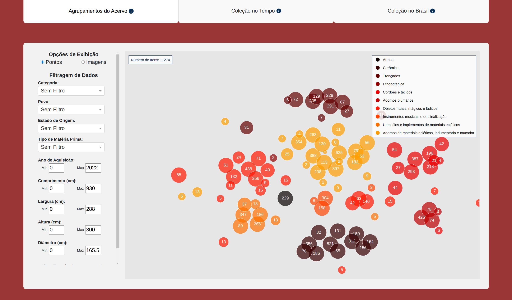

# Initiative for Indigenous Cultural Preservation in Brazil: a Study of Clusters and Communities

The modern world presents overwhelming challenges for most indigenous peoples, and Brazil is no exception. Urban development, often lacking in social responsibility, has led to the physical displacement of many indigenous people and a cultural erasure from the nation’s collective memory. Preserving their heritage has become a crucial task today. The [Brazilian Indigenous Museum](https://tainacan.museudoindio.gov.br/), through the [Tainacan platform](https://tainacan.org/), makes an effort in that direction by offering an extensive collection of indigenous artifacts, yet the accessibility and usability of this data remain limited due to the lack of proper structuring and interaction. Using data science and machine learning, we can explore new ways of organizing, visualizing, and analyzing this rich cultural heritage. This master thesis project thus aims to create an end-to-end pipeline that bridges indigenous knowledge with modern computational tools, being a cultural preservation initiative that contributes both to academic research and public engagement.

## Project Goals

The main challenges lie in extracting, organizing, and analyzing the data from the Tainacan platform, which is currently not readily usable for large-scale computational tasks. The metadata structuring is inconsistent, the images require preprocessing, there are almost no possibilities of exploring relationships between artifacts based on several dimensions such as visual similarity, geographic origin, or metadata attributes (i.e. textual descriptions of objects), and the interactivity with the collection is very limited. This project seeks to address these issues by building an end-to-end pipeline that starts with data extraction and normalization, followed by various applications of feature extraction, clustering and projection techniques to explore connections within the dataset, and finally the development of a tool for globally visualizing the collection. The aim is not only to understand these clusters but to compare them against one another, established indigenous literature and geographic data, creating an exploratory application that can inform and engage the general public through an interactive platform, as well as become a useful research instrument for future cataloging.

  

  Initial view of the visual tool.

## Repository Hierarchy

    .
    ├── assets                # Collection of images and GIFs used for the documentation
    ├── tainacan_collection   # Code collection for Tainacan data exploration (core code folder)
    |   ├── assets            # Stylesheets for visualization tool
    |   ├── image_based       # Code focused on image based feature extraction and clustering
    |   ├── language_based    # Code focused on language based feature extraction and clustering
    |   ├── multimodal        # Code focused on multimodal feature extraction and clustering
    |   └── ...
    ├── README.md
    ├── INSTALL.md            # Environment installation documentation
    ├── DATASET.md            # Data extraction and processing documentation
    ├── VISUALIZATION.md      # Visualization tool documentation
    ├── CLUSTERING.md         # Clustering experiments documentation
    └── ...

This is the base folder for the project. In here, you'll find:
 - The [install documentation](https://github.com/Luizerko/indigenous_clusters_and_communities/tree/main/INSTALL.md) to help set up your own environment.
 - The [dataset documentation](https://github.com/Luizerko/indigenous_clusters_and_communities/tree/main/DATASET.md) describing how the data was extracted and processed, as well as explaining its attributes. 
 - The [visualization tool documentation](https://github.com/Luizerko/indigenous_clusters_and_communities/tree/main/VISUALIZATION.md) containing details reagarding the tool egineering and visual examples of its parts.
 - The [clustering experiments documentation](https://github.com/Luizerko/master_thesis/tree/main/indigenous_project/CLUSTER.md) describing all the clustering technical implementations and obtained results.
 
If you want to take a look at the code itself, go into the [`tainacan_collection`](https://github.com/Luizerko/indigenous_clusters_and_communities/tree/main/tainacan_collection) folder and explore the individual files.

I hope you have as much fun going through the repo as I had developing it all :grin:

<!-- # Clustering Graffiti Around the World: a Visual Journey into Urban Art

Urban art, particularly graffiti, has long been a powerful form of self-expression and cultural commentary, transforming public spaces into dynamic canvases that challenge societal norms, celebrate diversity, and capture the spirit of urban life. The advent of technology and digital archiving, however, has changed the study and preservation of art, offering new ways to analyze and share cultural heritage. Graffiti, as a globally widespread art form, presents unique opportunities for digital exploration, greatly exemplified by the [Graffiti-Database](https://graffiti-database.com/). This project, therefore, lies at the intersection of artificial intelligence, digital cultural preservation, and visual arts, with a focus on clustering and visualization. Using machine learning techniques, we aim to analyze and interpret graffiti on a large scale, connecting visual patterns, artists’ styles, and geographic locations. This project addresses the need for an organized, accessible graffiti dataset with the possibility of exploring clusters based on artistic features, becoming an interactive tool that allows the general public to navigate and better engage with this form of art.

## Project Goals

The current challenge is to create a structured pipeline to analyze, and later visualize, graffiti images coming from two different online sources, [17K-Graffiti](http://visualdslab.com/papers/17KGraffiti/) and Graffiti-Database. This process starts with data collection through web scraping and image preprocessing, using a graffiti detection model to identify and isolate graffiti elements in each image. Once the dataset is created, we will explore various clustering methods based on visual features. To make these clusters easier to visualize, we’ll use embedding techniques to project high-dimensional data into lower-dimensional spaces.

The clustering will allow us to examine visual similarities among graffiti, providing a basis for comparing the results coming from different models and also comparing our findings to established art literature. We also aim to understand potential geographic connections between clusters, as well as connections between different artists. Our ultimate goal, therefore, is to develop an interactive platform where users can explore graffiti by groupings, geographical location, and artist, enhancing public access and engagement with graffiti art. If time permits, we’d like to go a step further by incorporating a style extraction network that allows users to apply graffiti styles from different clusters to their own images, making the platform even more artistically rich. -->