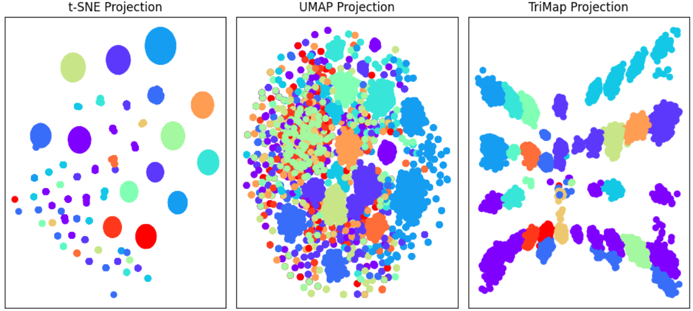
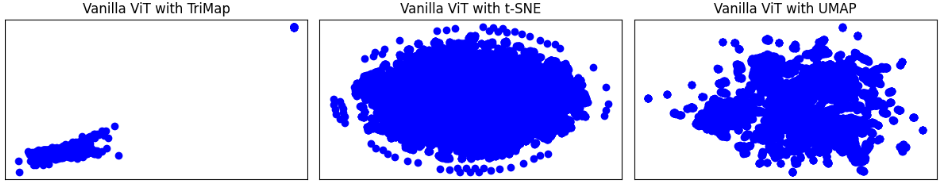
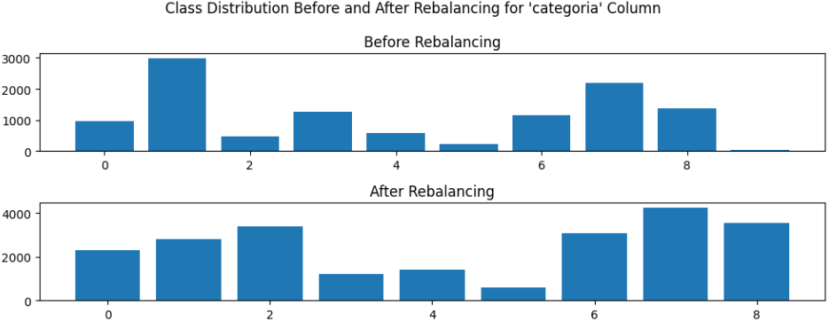
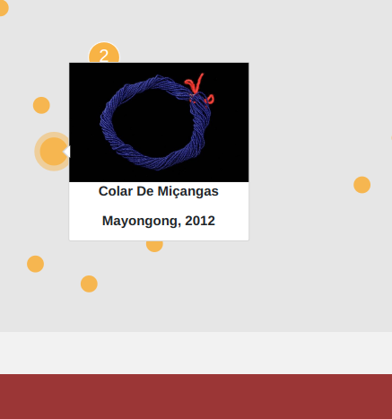
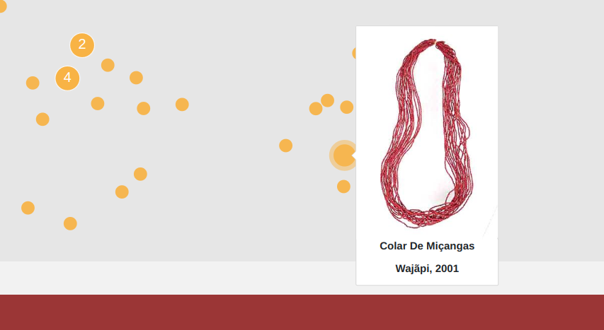
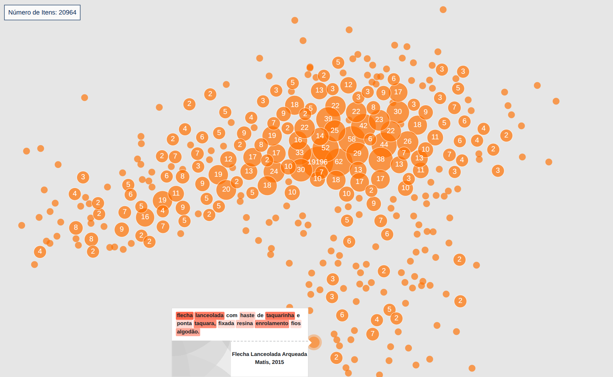

# Clustering Experiments

This page outlines the clustering experiments we conducted, ranging from simple baseline methods to more sophisticated grouping techniques. Here, you will find details on the approaches we implemented, insights into what worked well, reflections on the challenges we encountered, and conclusions we can draw from all that.

## The Baselines

Before applying advanced machine learning techniques, we began by exploring fundamental aspects of our data. Instead of immediately relying on advanced algorithms, we first sought to understand what insights could be (almost) directly extracted from the dataset and how domain knowledge from museum specialists could be integrated. Establishing these baselines seemed crucial for two reasons:

1. Comparing our clusters to existing knowledge: This helped evaluate how well our models captured essential patterns in the collection.

2. Identifying knowledge gaps: By analyzing our clustering results, we could pinpoint connections between items and communities that were previously not identified.

This analysis extends beyond traditional quantitative measures, such as embedding space distribution and clustering algorithm performance. Instead, it also focus on the qualitative aspects, like evaluating whether the clusters align with meaningful patterns within the collection and how effectively they reveal new insights.

### Random Orthonormal Projections

To establish these baselines, we first explored clustering categorical attributes by mapping them into a higher-dimensional space. We couldn't, however, assume any inherent relationships between categories, making it crucial to treat clusters as equidistant. To enforce that, we applied *random orthonormal projections*. For each attribute (in our expetiment `categoria` with 10 categories and `tipo_de_materia_prima` with 4 categories), we generated a random orthonormal matrix, ensuring every category had a unit vector, all of them orthogonal to one another. For multi-category attributes, we summed categories' vectors when a datapoint belonged to more than 1 category. This produced "high-dimensional" representations of data that we could use for clustering.

While theoretically interesting, this approach naturally failed. The resulting space was highly sparse, leading to poor clustering and later visualization. Even before clustering, lower-dimensional projections showed no clear groupings or symmetry.

To better preserve distances, we tested two projection techniques:

- *MDS:* Effective in low dimensions (so 14 shouldn't be a problem) and optimizes for distance preservation.

- *TriMap:* Suitable for higher-dimensional spaces while maintaining global structure.

Despite slight improvements with *TriMap*, neither method yielded meaningful clusters.

     
    

    Plot showing <i>MDS</i> and <i>TriMap</i> 2D projections from random orthonormal vectors for the 2 aforementioned attributes concatenated (14 dimensions).
     

### Categorical Clustering

After the failure of *random orthonormal projections*, we returned directly to categorical clustering. We used *multi-hot encoding* to transform attributes with multi-category assignments into binary vectors. Then, we applied *K-Modes*, a clustering algorithm designed for categorical data that measures dissimilarity based on category mismatches instead of Euclidean distance.

Using `categoria` and `tipo_de_materia_prima` again and the *elbow method*, we found that 16 clusters provided the best balance, slightly exceeding the sum of individual category counts (14 in total), not suggesting an overestimation but still accounting for possible correlations between categories across the attributes. While this approach prevented cluster assignment issues through the direct use of the categories, we still had a very sparse feature space and visualization remained challenging.

- *t-SNE* failed, producing unnatural circular patterns due to its KL-Divergence minimization on (sparse) categorical data.

- *UMAP* struggled, as the sparse feature space violated its assumption of an underlying manifold, leading to a chaotic point cloud.

- *TriMap* performed best, forming a few maybe identifiable clusters. However, some clusters split across multiple areas - necessary for preserving some kind of equidistance between all clusters in 2D. Despite this improvement, visualization remained fairly unclear.

     
    

    Plot showing <i>t-SNE</i>, <i>UMAP</i>, and <i>TriMap</i> 2D projections from categorical vectors for 2 concatenated attributes (14 dimensions).
     

### Basic Attribute-Based Clustering  

Due to the failures of the previous methods, we opted for a simpler approach, directly using only the most well-defined and easily visualized attribute as baseline: `tipo_de_materia_prima`. This attribute has three meaningful categories - 'animal', 'vegetal', and 'mineral'. A fourth category ('sintetico') exists, but no data points fall into this group. Items can also belong to multiple categories.

To represent clusters in 2D, we used a triangle representation:

- Each vertex represents one category ('animal', 'vegetal', or 'mineral').

- Midpoints between vertices represent items that belong to two categories (each one of the closest vertices).

- Items that belong to all three categories are placed in the center of the triangle.

Since each category would otherwise collapse into a single point, making visualization difficult, we added *2D Gaussian noise* to create a point-cloud effect.

     
    

    Plot showing clusters of <code>tipo_de_materia_prima</code>.
     

### Specialist Taxonomy

The ideal baseline for our models, of course, would be a well-established, specialist-curated taxonomy - one that mapped out all indigenous communities and their relationships through deep cultural and historical research. As a proxy, we initially considered using the indigenous language family tree, since language is often one of the clearest indicators of cultural proximity. However, this tree is incomplete, fragmented, and not available in a computationally structured format that could be easily integrated into our modeling pipeline.

We also reached out to museum experts in indigenous cultures across Brazil, hoping to find a more formal structure. What we discovered, however, was that while specialists exist for (nearly) every documented community, their expertise is often highly localized. Each expert typically focuses on a specific group, region, or cultural context, and there is no centralized taxonomy that connects these communities in a unified or comparative way.

That realization shifted our perspective entirely. We were initially focused on building models that would need validation against an established reference, but it turned out that such a reference doesn’t exist in the way we imagined. Instead, our work has the potential to offer a new kind of tool: something that can help indigenous scholars and museum professionals uncover patterns, connections across communities that may not have been formally documented before.

Rather than aligning our models to a fixed taxonomy, we began to see the platform as a way to co-create knowledge - a starting point for exploring community relationships through new lens. The point clouds, embeddings, and search features we'll discuss in the following sections provide a novel way of navigating and comparing cultural artifacts, suggesting possible affinities that can then be further examined and validated by specialists.

In the end, the "baseline" we were searching for was not something pre-existing, but something that this very work could help build: a dynamic, evolving foundation to support future taxonomies, guided by both technology and the communities that understand these cultural expressions best.

## Clustering Through Machine Learning

### Image-Based Clustering

This section delves into the technical aspects of one of our machine learning approaches: using image-based clustering to group items, aiming to understand how they connect through visual similarities. The results of this process serve two main purposes:

1. Enhancing collection navigation: By clustering visually similar items together, we create an interactive and intuitive way for users to explore the collection. Similar items will be positioned in close proximity within our final projection, allowing users to navigate different “micro-universes” of the collection, observe category transitions, and explore relationships between items.  

2. Uncovering latent relationships: Our models help to reveal previously undocumented connections between groups of items or cultural communities. This is particularly valuable for researchers studying indigenous peoples, as it provides insights into shared artistic or manufacturing traditions. Given the lack of centralized taxonomies for indigenous groups in Brazil, our tool could serve as a pivotal resource for broader ethnographic studies in the country.  

To implement this, we use image feature extractors to project background-removed images (see [dataset documentation](https://github.com/Luizerko/indigenous_clusters_and_communities/tree/main/DATASET.md) for details) into high-dimensional space. We then apply dimensionality reduction techniques to visualize the clusters.

Beyond simple projections, we experimented with fine-tuning models to improve item dispersion and enable subdivision by specific attributes (e.g., `povo`, `categoria` or both). This allows users to explore both individual item neighborhoods and broader categorical relationships within the dataset. 

We now proceed to describe the technical pipelines implemented, report the obtained results and show some of the generated images for clarity. For this stage, we used two main feature extraction models, both based on transformers. Transformer-based architectures are currently state-of-the-art for feature extraction, as they leverage pretrained backbones with the best results when optimized on other large-scale tasks.

#### ViT Base (Patch 16x16)

We started with the *[ViT Base](https://huggingface.co/google/vit-base-patch16-224-in21k)* model with 16x16 patches, trained on *ImageNet21K*. Although no longer cutting-edge, *ViT* remains a foundational model in the field and serves as a solid reference point for transformer-based architectures. Many state-of-the-art models, including the next one we discuss (*DINOv2*), build upon it.

For preprocessing, we resized images to 224x224 (cropping if larger in any dimension and bilinear interpolation if smaller), then normalized them using a mean of 0.5 and a standard deviation of 0.5 for all channels, following the model’s preprocessing pipeline.

Using only the pretrained backbone, we projected the images into a high-dimensional space and applied dimensionality reduction techniques to generate 2D visualizations for the interactive tool. We tested three different techniques:

- *TriMap:* Poor results, with minimal data dispersion and poor visual separation.

- *t-SNE:* Produced an entangled, chaotic cloud with no clear clusters.

- *UMAP:* Successfully created a meaningful manifold, capturing structure with the vanilla pretrained model and groupings when fine-tuned (as discussed later).  

   
  
  

    2D projections using <i>TriMap</i>, <i>t-SNE</i>, and <i>UMAP</i> with the vanilla pretrained <i>ViT</i> model. <i>UMAP</i> (right) was the best method in providing meaningful spread of the data, which later improved with fine-tuning.
  

   

The resulting projection reveals a dense point cloud due to the lack of a specific fine-tunning category. However, a continuous manifold emerges, where visually similar items are positioned close together. This reflects the model’s ability to capture diverse visual similarities, including shape, colors, texture and details. This manifold alone offers a unique and interactive way to navigate the collection. But what happens when we introduce more structured knowledge into the data?

To refine clustering, we performed fine-tuning using the `povo` and `categoria` attributes, aiming for semantically distinct item groupings. This allows for categorical exploration and a more nuanced understanding of relationships between indigenous communities and their artistic traditions.

For that, we added a *classification head* to the network’s backbone - a single linear layer with 768-dimensional output from the backbone as the input size and the number of classes in the chosen feature as the output size. While common fine-tuning methods involve adding a small fully connected network, *ViT* fine-tuning is typically performed by adding a single linear layer at the top of the network, as supported by section 3.1 of the [*ViT* original paper](https://ar5iv.labs.arxiv.org/html/2010.11929) and section 3.2 of [another paper](https://openreview.net/pdf?id=4nPswr1KcP) that explores *ViT* training and fine-tunning strategies.

##### Fine-Tunning Models

We fine-tuned the imagetic models using *supervised learning* on two attributes: `povo` and `categoria`. The goal was to train the networks to classify these correctly and then return to the base-model embeddings to assess how well they captured dataset-specific visual semantics. This helped adapt the models to our context and improve their usefulness for visual similarity exploration.

As the original base-model had no classification head, there’s no quantitative baseline for comparison. Still, strong classification performance and qualitative analysis of projections suggest that the models did learn meaningful visual features. We also compare trained models to one another to show how different design choices impacted the results.

Going into the implementation details, the dataset was split into 80% training, 10% validation, 10% test, and the original collection contained approximately 11K images. For each model, we tracked *loss*, *validation accuracy*, *average class precision* and *average class recall*. All models were fine-tuned on a 8GB RTX 4070 until convergence (typically between 20 and 30 epochs) using the *Adam optimizer* (with weight decay), *cross-entropy loss* (either with or without weights), *early stopping* (1% accuracy tolerance and 3-iteration patience), and five runs per model (for mean and standard deviation analysis).

Most models, however, were not fine-tuned directly on the original dataset due to severe class imbalance for `povo` and, to a lesser extent, `categoria`. To address this, we developed a *rebalancing pipeline*, which significantly improved model performance.

For `povo`, we started by understanding the distribution. We analyzed the quantiles of class sizes. `povo` contains 187 classes, but 25% of these (~47 classes) have only 4 images, definetly insufficient for training. After removing these 25% least populated classes, around 99% of the dataset remains intact. We ended up removing 75% of the least populated classes (~138 classes, including the aforementioned ~47 classes), keeping only classes with more than 65 images and still preserving around 85% of the original data.

Despite filtering, class sizes still varied significantly. To address this we performed a class median analysis: classes with more than 2 times the median image count were labeled as "majority classes", and others were labeled as "minority classes". After that we started data augmentation for minority classes through random horizontal flips, random vertical flips and random Gaussian blur. For the majority classes, in turn, we randomly (under)sampled images to match minority class sizes. Notice, however, that only augmenting minority classes could introduce a bias where the model differentiates minority/majority classes based on artificially added noise. Thus, we applied stronger undersampling to majority classes and then also augmented them.  

   
  
  
  

    Class distribution before and after applying the rebalancing pipeline for <code>povo</code> (left) and <code>categoria</code> (right). The adjustments - filtering, augmentation and undersampling - led to more uniform class representation during training.
  

   

Even after balancing, class disparities remained though. Because of that, we assigned weights inversely proportional to the amount of data a class had, ensuring equal contribution during training.  

For `categoria`, the procedure was nearly identical to `povo`, with one key difference: only one class ('etnobotânica') was significantly underrepresented. Hence, instead of a full quantile study, we filtered out this single class. The remaining balancing steps followed the same augmentation, undersampling, and weight adjustment process.

The tables below summarizes the parameters for different models and the corresponding quantitative results.

| Dataset | Learning Rate | Weight Decay | Frozen Layers (%) | Weighted Loss | Test Accuracy (%) | Avg. Precision | Avg. Recall | Avg. Precision on Selected Classes | Avg. Recall on Selected Classes | 
|-|-|-|-|-|-|-|-|-|-|
| Original | 5e-5 | 2e-6 | 0 | False | 68.32 ± 1.52 | 0.29 ± 0.02 | 0.26 ± 0.02 | 0.58 ± 0.01 | 0.62 ± 0.01 |
| Balanced | 2e-5 | 2e-6 | 0 | True | **70.99 ± 0.73** | - | - | **0.71 ± 0.02** | **0.69 ± 0.02** |
| Balanced | 2e-5 | 2e-6 | 50 | True | <ins>70.04 ± 1.75</ins> | - | - | <ins>0.69 ± 0.02</ins> | <ins>0.65 ± 0.03</ins> |
| Balanced | 2e-5 | 2e-6 | 80 | True | 67.48 ± 1.13 | - | - | 0.64 ± 0.01 | 0.62 ± 0.01 |

  Parameters and results for <i>ViT</i> models fine-tuned on <code>povo</code>.

| Dataset | Learning Rate | Weight Decay | Frozen Layers (%) | Weighted Loss | Test Accuracy (%) | Avg. Precision | Avg. Recall | Avg. Precision on Selected Classes | Avg. Recall on Selected Classes | 
|-|-|-|-|-|-|-|-|-|-|
| Original | 1e-5 | 2e-6 | 0 | False | <ins>87.60 ± 0.81</ins> | 0.78 ± 0.01 | 0.76 ± 0.01 | <ins>0.86 ± 0.02</ins> | <ins>0.84 ± 0.01</ins> |
| Balanced | 3e-6 | 1e-6 | 0 | True | **88.64 ± 1.53** | - | - | **0.88 ± 0.01** | **0.85 ± 0.01** |
| Balanced | 3e-6 | 1e-6 | 50 | True | 87.43 ± 1.37 | - | - | <ins>0.86 ± 0.02</ins> | **0.85 ± 0.02** |
| Balanced | 3e-6 | 1e-6 | 80 | True | 86.30 ± 1.30 | - | - | 0.84 ± 0.02 | 0.83 ± 0.02 |

  Parameters and results for <i>ViT</i> models fine-tuned on <code>categoria</code>.

Before diving into the interpretation of these results, it's important to clarify a few details about the evaluation process. The metrics for average precision and recall in the original dataset case for `povo` are significantly lower than in the balanced case - not only because of model performance, but also due to the vast number of classes included. The `povo` column includes nearly 200 communities, many of which have very little data, making accurate classification extremely challenging. To make the comparison fair, we introduced two extra columns: *Avg. Precision on Selected Classes* and *Avg. Recall on Selected Classes*. These are computed only on the subset of classes retained after rebalancing, allowing for a more direct comparison between models fine-tuned on the original dataset and those fine-tuned on the balanced version. This helps isolate the effects of balancing and training strategy, instead of having the metric dominated by dozens of poorly represented classes.

These results highlight a few important trends. First, models fine-tuned on the balanced datasets consistently outperformed those fine-tuned on the original, imbalanced data - both in terms of overall accuracy and especially in precision and recall for selected classes. This underscores the importance of dataset curation and balancing when working with real-world, imbalanced collections.

Second, we observed that freezing layers negatively impacted performance, particularly when freezing more than 50% of the model. This suggests that the generalization capacity of the pre-trained *ViT* model is limited, at least when it comes to our specific dataset, and that more extensive fine-tuning is required for the model to adapt meaningfully to our task. This behavior differs from what we’ll later observe with another architecture, and we’ll explore that in the following section.

Looking beyond the raw numbers, it’s also helpful to consider the embedding spaces produced by these models. When we project the full dataset (especially for `povo`) into 2D using *UMAP*, the spread of points appears noisy and unstructured at first glance. This lack of global structure is expected: most classes were filtered out due to insufficient data and never seen during training. However, local structures do emerge. When filtering the projection to highlight only a single community, items for that community tend to be grouped closely together, validating that the model learns consistent visual signatures for groups it has seen enough of. In some cases, we can also see visual affinities between specific communities, hinting at stylistic or material overlaps - something that the platform enables users to explore dynamically.

The story is quite different for `categoria`. Here, the spread is much cleaner, and we can clearly see well-defined clusters for most categories. These clusters often sit close to others with which they share visual or material similarities. Interestingly, when inspecting the edges of clusters, we see a smooth transition: the items on the edge of one category often resemble those on the nearest edge of a neighboring cluster. This is proof of a meaningful data manifold, where inter-class similarity is encoded naturally within the latent space. Within each cluster, there's also a strong internal structure - items flow from some examples to others along continuous directions. One notable exception is the class 'etnobotânica', which was not retained during fine-tuning due to lack of data. As expected, its samples are scattered across all clusters, showing weak cohesion but also ratifying the model’s ability to project items based on their visual similarities since items from this class are visually very different from one another.

   
  
  
  

    Embedding spaces generated by the <i>ViT</i> model fine-tuned on <code>povo</code> (left) and <code>categoria</code> (right). While <code>povo</code> shows limited global structure due to class imbalance and filtering, <code>categoria</code> exhibits well-defined clusters and a coherent manifold, with smoother transitions and internal organization.
  

   

Going even beyond, one of the most exciting outcomes of these models - especially the ones fine-tuned for `categoria` - was their ability to offer qualitative insights into the collection. For example, in analyzing projections, we discovered that necklaces from the *Mayongong* people display a broad color diversity, with several items featuring vibrant palettes not commonly seen for other groups. Intriguingly, some of these color schemes overlapped with those found in *Kamayurá* and *Kuikuro* necklaces, suggesting possible shared stylistic influences or at least material sources.

Another compelling observation was that both *Kamayurá* and *Kuikuro* necklaces frequently use a large lace to tie them, in contrast to the more commonly seen smaller wrap-style lace in other communities. The model's grouping behavior helped surface this design pattern, which might otherwise have been missed. We also noticed similarities between *Wajãpi* and *Wayana-Apalai* necklaces, especially in their color and layout, highlighting potential cultural or artisanal connections.

   
  
  
  
  

    Visual similarities between necklaces from the <i>Mayongong</i> (left), <i>Kamayurá</i> (center), and <i>Kuikuro</i> (right). The model highlighted overlapping color palettes between all and distinctive tie styles between the last two, suggesting possible shared stylistic or material influences.
  

   

   
  
  
  

    Necklace designs from the <i>Wajãpi</i> (left) and <i>Wayana-Apalai</i> (right). The model's clustering revealed subtle yet consistent visual parallels in color choice and layout, indicating potential artisanal or cultural connections.
  

   

This is just one brief and surface-level example of the insights we were able to quickly uncover in the dataset. It highlights the potential for much deeper investigation, even for people without formal expertise in indigenous communities.

Furthermore, the model proved to be a valuable tool for identifying outliers. For instance, we detected a ceramic piece from the *Waurá* community that was mistakenly labeled as belonging to the 'trançado' category. It appeared embedded within the ceramic cluster in our embeddings space though, indicating a strong visual similarity to other ceramics despite its incorrect categorization. This kind of flagging can help curators re-examine potential misclassifications and uncover hidden relationships across items and communities.

   
  
  
   
  

    Example of a typical ceramic piece (left) and the misclassified outlier (right), originally labeled as 'trançado'. Despite the incorrect label, the model placed it within the ceramic cluster in the embedding space, showcasing its potential to surface visually consistent but categorically inconsistent items.
  

   

In addition to the previously mentioned models, we developed a *multi-head model* to explore the semantics of the network’s image projections when optimizing for both attributes simultaneously. We implemented two classification heads - one for `povo` and another for `categoria` - with the loss being the weighted average of both losses.

Balancing the dataset was even more challenging in this case, as optimizing for one attribute could disrupt the other. Joint distribution balancing was impractical due to the vast number of classes and because of the even worse joint-class imbalance, with little correlation between `povo` and `categoria`. Ultimately, we used the previously filtered classes for both attributes and initially balanced only for `povo`. This approach had minimal impact on `categoria`, which was already less imbalanced and not a major issue.

The table below summarizes the parameters for different head weights and the corresponding quantitative results.

| Learning Rate | Weight Decay | Head Weights (`povo`/`categoria`) | `povo` Head Test Accuracy (%) | `povo` Head Avg. Precision on Selected Classes | `povo` Head Avg. Recall on Selected Classes | `categoria` Head Test Accuracy (%) | `categoria` Head Avg. Precision on Selected Classes | `categoria` Head Avg. recall on Selected Classes |
|-|-|-|-|-|-|-|-|-|
| 1e-5 | 3e-6 | 50/50 | **71.38 ± 1.29** | **0.72 ± 0.02** | **0.68 ± 0.02** | 88.16 ± 0.59 | <ins>0.86 ± 0.01</ins> | 0.85 ± 0.02 |
| 1e-5 | 3e-6 | 70/30 | <ins>71.16 ± 1.86</ins> | **0.72 ± 0.02** | **0.68 ± 0.02** | <ins>89.26 ± 1.20</ins> | **0.89 ± 0.01** | **0.88 ± 0.02** |
| 1e-5 | 3e-6 | 30/70 | 70.28 ± 0.95 | <ins>0.69 ± 0.01</ins> | **0.68 ± 0.01** | **89.40 ± 1.09** | **0.89 ± 0.02** | <ins>0.87 ± 0.02</ins> |

  Parameters and results for multi-head <i>ViT</i> models fine-tuned on both <code>povo</code> and <code>categoria</code>. The columns <i>Dataset</i>, <i>Frozen Layers (%)</i>, <i>Weighted Loss</i>, <i>Avg. Precision</i> and <i>Avg. Recall</i> are not found in this table because we fine-tuned all models with the same (balanced) dataset, no frozen layers, always with weighted loss for both heads and only on the selected categories.

Training the model in a multi-head configuration resulted in small but consistent performance improvements over the single-task baselines. Comparing the best multi-head models to the best single-head models fine-tuned on the balanced dataset (no frozen layers), we see slightly higher accuracy and better precision/recall scores for both heads. This indicates that the model is able to leverage shared representations across tasks, enriching its internal features and learning complementary patterns from both `povo` and `categoria` labels.

It is worth noting, however, that the gain is relatively modest. This likely reflects the greater complexity of the `povo` task, which still suffers from data scarcity and class imbalance, even in the rebalanced version. Additionally, optimizing for both heads simultaneously introduces a trade-off, where improvements on one head may slightly constrain the other. Even so, the ability to train a single unified model for both classification tasks is advantageous for efficiency and introduces a new type of embedding space - one that theoretically captures combined semantics from both labels.

When examining the embedding space of the multi-head model, we see that it still struggles to separate `povo` classes clearly. The diversity and number of community labels, combined with limited examples for each, make global structure difficult to establish regardless of jointly using another label. The spread remains somewhat diffuse, with most points forming an indistinct cloud. However, it is encouraging that local clusters for `categoria` do emerge, even under this joint training regime. These clusters reflect the more structured and visually consistent nature of the `categoria` labels, as well as their stronger representation in the dataset.

This behavior reinforces previous observations: `categoria` benefits from greater cohesion and clearer visual boundaries, which translates into more structured embeddings, even when learned alongside a noisier signal like `povo`. Meanwhile, `povo` continues to be more challenging, but not without value, especially when investigating local patterns and visual similarities between communities.

   
  
  

    Embedding space of the multi-head <i>ViT</i> model fine-tuned on both <code>povo</code> and <code>categoria</code> and colored based on <code>categoria</code>. Despite the diffuse spread for <code>povo</code>, clearer cluster structures for <code>categoria</code> can still be observed, demonstrating that joint training can retain meaningful representations for visually coherent classes.
  

   

#### DINOv2

After exploring the performance of the *ViT* architecture, we moved on to a more modern model (*DINOv2*) to evaluate its potential and investigate how a self-supervised backbone might differ in both quantitative results and visual embedding structure. *DINOv2* has been shown to generalize well across multiple visual tasks without requiring large-scale supervised fine-tuning, making it a promising candidate for clustering goals.

Unlike *ViT*, which is trained in a supervised manner, *DINOv2* is pre-trained using a self-supervised learning objective based on knowledge distillation. It uses a teacher-student setup where the student model learns to match the output of a (slowly evolving non-gradient based) teacher model across multiple augmented views of the same image. This allows *DINOv2* to train with much more data (around 10 times more than ViT) and learn more robust semantic visual representations that generalize well across downstream tasks. Objectively, it uses a curated dataset of around 142M unlabeled images called *LVD-142M*, which also includes the whole *ImageNet21K*.

We used the [base version of *DINOv2*](https://huggingface.co/facebook/dinov2-base) and applied a similar preprocessing pipeline to that used with *ViT*, but with minor adjustments: images were resized so that the shorter side was 256 pixels, then center-cropped to 224×224, and normalized using the standard *ImageNet* statistics (`[0.485, 0.456, 0.406]` means and `[0.229, 0.224, 0.225]` standard deviations).

Like before, we extracted embeddings using the pretrained backbone and projected them into 2D using the *UMAP* technique, which had previously shown the best performance in capturing meaningful structure. Even in its vanilla form, *DINOv2* generated a smooth and semantically rich manifold, offering a compelling visual spread where visually similar objects naturally clustered together.

To better structure this space semantically, we fine-tuned *DINOv2* using both `povo` and `categoria` as classification targets again. As with *ViT*, we added a single linear classification head to the model - taking the 768-dimensional output from the backbone and projecting it to the number of target classes. This simple architecture was chosen this time to ensure a fair comparison to the *ViT* models we fine-tuned.

##### Fine-Tunning Models

The tables below present results from fine-tuning *DINOv2* models on both `povo` and `categoria`, using similar experimental setups as before.

| Dataset | Learning Rate | Weight Decay | Frozen Layers (%) | Weighted Loss | Test Accuracy (%) | Avg. Precision | Avg. Recall | Avg. Precision on Selected Classes | Avg. Recall on Selected Classes | 
|-|-|-|-|-|-|-|-|-|-|
| Original | 1e-6 | 3e-7 | 0 | False | 62.73 ± 0.62 | 0.23 ± 0.01 | 0.20 ± 0.01 | 0.53 ± 0.02 | 0.52 ± 0.01 |
| Balanced | 1e-6 | 3e-7 | 0 | True | 71.46 ± 1.13 | - | - | 0.70 ± 0.01 | 0.67 ± 0.01 |
| Balanced | 1e-6 | 3e-7 | 50 | True | <ins>73.45 ± 1.38</ins> | - | - | <ins>0.72 ± 0.02</ins> | <ins>0.70 ± 0.03</ins> |
| Balanced | 1e-6 | 3e-7 | 80 | True | **74.70 ± 1.24** | - | - | **0.74 ± 0.03** | **0.71 ± 0.01** |

  Parameters and results for <i>DINOv2</i> models fine-tuned on <code>povo</code>.

| Dataset | Learning Rate | Weight Decay | Frozen Layers (%) | Weighted Loss | Test Accuracy (%) | Avg. Precision | Avg. Recall | Avg. Precision on Selected Classes | Avg. Recall on Selected Classes | 
|-|-|-|-|-|-|-|-|-|-|
| Original | 3e-7 | 1e-7 | 0 | False | 86.60 ± 1.44 | 0.80 ± 0.06 | 0.78 ± 0.04 | <ins>0.84 ± 0.03</ins> | 0.83 ± 0.02 |
| Balanced | 3e-7 | 1e-7 | 0 | True | <ins>90.21 ± 1.22</ins> | - | - | **0.87 ± 0.02** | **0.88 ± 0.02** |
| Balanced | 3e-7 | 1e-7 | 50 | True | 89.90 ± 0.88 | - | - | **0.87 ± 0.01** | <ins>0.87 ± 0.02</ins> |
| Balanced | 3e-7 | 1e-7 | 80 | True | **90.52 ± 0.64** | - | - | **0.87 ± 0.01** | **0.88 ± 0.01** |

  Parameters and results for <i>DINOv2</i> models fine-tuned on <code>categoria</code>.

For `povo`, we observed that *DINOv2* struggled more than *ViT* on the original, imbalanced dataset, achieving lower accuracy and weaker recall and precision. However, it benefited more dramatically from the rebalancing step. Once fine-tuned on the balanced dataset, *DINOv2* not only caught up with *ViT*’s performance, it surpassed it. The model reached a test accuracy of nearly 4 points higher than *ViT*’s best result on the same task. Similarly, the precision and recall scores also improved.

An interesting trend emerged when we introduced layer freezing. Unlike *ViT*, where freezing harmed performance, *DINOv2* models benefited from freezing a significant portion of their layers. With 80% of the layers frozen, we achieved the best results on `povo`. This strongly suggests that *DINOv2*'s early layers encode features that generalize more effectively, and that the model can adapt well to our dataset with minimal fine-tuning - focusing only on higher-level representations. This is a notable distinction from *ViT*, where full fine-tuning was important to achieve the best results.

For `categoria`, *DINOv2* also achieved the highest accuracy overall. Precision and recall did not follow as much, in the sense that we did not see results getting much better than the ones for *ViT*, but still either similar or slightly better. In general, these improvements reinforce the idea that *DINOv2* was better equipped to extract meaningful visual patterns in categories for our data.

However, despite these promising results, the visual projections generated on top of *DINOv2* did not improve proportionally. When analyzing the 2D embeddings of the entire dataset via *UMAP* projection, the clusters were not always more distinct or interpretable than those produced by *ViT*. In fact, while *DINOv2* captured a broader and smoother spread of the collection in its raw, vanilla embedding, grouping behaviors were generally clearer in the *ViT* model. As a result, we made a deliberate trade-off in our platform design: we chose to use *ViT*-based projections for `povo` and `categoria`, where grouping was more distinct.

   
  
  

      Comparison between the projected embedding spaces of <i>ViT</i> and <i>DINOv2</i> models single-task fine-tuned both on <code>povo</code> and <code>categoria</code>.
  

   

This decision is somewhat counter-intuitive since the projections shown to the end-user do not come from the best-performing models (in terms of metrics). Instead, we prioritized interpretability and visual coherence over a small gain in classification performance. It's important to note, however, that the trade-off is not gigantic - we’re not sacrificing 20% accuracy to get better visuals. The differences are typically just 2-3% in accuracy, and between 0.02-0.03 in precision and recall. Given this context, the improved visual experience and interpretability were valued more than the marginal performance bump.

We also evaluated multi-head configurations using *DINOv2*. Interestingly, the multi-head setup did not provide significant benefits over the balanced single-task models. In contrast to *ViT*, where we observed small but consistent gains, *DINOv2*'s performance in multi-task training remained essentially on par or slightly worse than the best single-head fine-tuned models. It’s also worth noting that the multi-head models were fine-tuned with no frozen layers, making a fair comparison most appropriate against the unfrozen balanced *DINOv2* runs (not the best performing ones). In this context, multi-head training offered no clear advantage.

| Learning Rate | Weight Decay | Head Weights (`povo`/`categoria`) | `povo` Head Test Accuracy (%) | `povo` Head Avg. Precision on Selected Classes | `povo` Head Avg. Recall on Selected Classes | `categoria` Head Test Accuracy (%) | `categoria` Head Avg. Precision on Selected Classes | `categoria` Head Avg. recall on Selected Classes |
|-|-|-|-|-|-|-|-|-|
| 3e-7 | 1e-7 | 50/50 | <ins>69.61 ± 1.00</ins> | **0.68 ± 0.01** | <ins>0.66 ± 0.03</ins> | **89.61 ± 0.60** | **0.87 ± 0.01** | **0.87 ± 0.01** |
| 3e-7 | 1e-7 | 70/30 | 68.91 ± 1.12 | **0.68 ± 0.01** | <ins>0.66 ± 0.00</ins> | 87.69 ± 1.38 | <ins>0.85 ± 0.02</ins> | 0.85 ± 0.02 |
| 3e-7 | 1e-7 | 30/70 | **70.86 ± 1.34** | **0.68 ± 0.01** | **0.67 ± 0.02** | <ins>89.05 ± 0.53</ins> | **0.87 ± 0.01** | <ins>0.86 ± 0.02</ins> |

  Parameters and results for multi-head <i>DINOv2</i> models fine-tuned on both <code>povo</code> and <code>categoria</code>. The columns <i>Dataset</i>, <i>Frozen Layers (%)</i>, <i>Weighted Loss</i>, <i>Avg. Precision</i> and <i>Avg. Recall</i> are not found in this table because we fine-tuned all models with the same (balanced) dataset, no frozen layers, always with weighted loss for both heads and only on the selected categories.

That said, the multi-head *DINOv2* projection was still selected for visualization over the *ViT* multi-head one. Just like the vanilla *DINOv2* projection, the multi-head model provided a smoother point cloud with better continuity across data points - a quality we found valuable for exploration, filtering, and semantic-based search.

   
  
  

      Embedding space of the multi-head <i>DINOv2</i> model fine-tuned on both <code>povo</code> and <code>categoria</code>, with points colored by <code>categoria</code>. Compared to the equivalent <i>ViT</i> model, the clusters are more clearly defined, and the overall data distribution appears smoother and more continuous when looking at the visualization tool.
  

   

In short, *DINOv2* proved to be a stronger model in terms of raw classification performance, especially after balancing and partial freezing. But when it came to visual quality of the embeddings, *ViT* still held an edge in the grouping structure for our key labels, leading to a strategy of using results coming from both models for the visualization tool tailored to our end-user goals.

### Text-Based Clustering

Analogous to our previous work on image-based clustering, we have developed a textual clustering approach. The fundamental goal remains consistent, enhancing navigation and uncovering latent relationships within the data, but this time we utilize textual descriptions rather than images. For detailed insights into our preprocessing methods, please refer to the [dataset documentation](https://github.com/Luizerko/indigenous_clusters_and_communities/tree/main/docs/DATASET.md). Notably, we are working with "summarized" versions of the textual descriptions instead of their full-length counterparts. The reasons for this choice are elaborated in the dataset documentation.

 Very similarly to what we did for the imagetic pipeline, our textual clustering utilizes encoders to extract sentence-level features, followed by dimensionality reduction techniques to visualize point clouds and potential clusters. We experimented with two different encoder models: [*BERTimbau (base)*](https://huggingface.co/neuralmind/bert-base-portuguese-cased), a widely-used encoder for Brazilian Portuguese, and [*Albertina (100M)*](https://huggingface.co/albertina-ptbr/albertina-100m), a more modern model with better benchmark scores (on the bigger versions). Due to hardware limitations, we selected the smallest available versions of each model. Despite this, we obtained visually appealing and insightful results.

Beyond simple projections from pre-trained (vanilla) models, unlike our straightforward supervised approach in the image pipeline, we experimented with two fine-tuning strategies using *contrastive learning*:

- *Unsupervised*: Based on the [unsupervised SimCSE](https://arxiv.org/pdf/2104.08821) method. The method's core idea is, in the absence of labeled sentence pairs, adding a dropout layer on top of the encoder network to generate variability in embeddings. Specifically, we run each description through the encoder twice within the same batch. Due to dropout randomness, the same description produces two slightly different embeddings, effectively creating positive pairs. Embeddings from other descriptions in the batch serve as negative examples, a desirable setup since contrastive learning works better on distinguishing a target sentence from multiple dissimilar ones.

  We will discuss specific training details alongside the model descriptions, however, an important factor that may affect training performance deserves mention: the abundant presence of very similar or identical descriptions, also known as hard examples. Even with randomized training data to prevent sequential similarity, certain descriptions remain notably alike due to similar creation techniques (e.g., painting in circular or diagonal patterns), shared materials (e.g., identical plants or fruits), variations of the same object (e.g., two dolls, two arrows) or combinations of these factors. Despite this challenge, our models achieved good results, indicating successful learning. Nonetheless, we haven't fully examined how this phenomenon impacted training outcomes, whether beneficially by improving model discrimination for challenging examples, or detrimentally by unnecessarily distancing embeddings of highly similar sentences.

  Now talking about the loss, the core of our objective is the *[Normalized Temperature-scaled Cross Entropy (NT-Xent) loss](https://arxiv.org/pdf/2002.05709)*, which encourages each pair of “positive” embeddings (two stochastic views of the same description) to be more similar than any “negative” pair in the batch. Intuitively, after we *L2-normalize* all embeddings so that *cosine similarity* is just a dot-product on the unit sphere, the *NT-Xent loss* computes for each anchor embedding a *softmax* over its cosine similarities to all other embeddings. The numerator pulls up the similarity score to its positive counterpart, while the denominator sums over all similarities (positive and negatives), so minimizing this loss pushes positives closer together and pushes all negatives farther apart in the embedding space.

  A key hyperparameter is the *temperature* (*t*): dividing the cosine similarity logits by *t* before the softmax effectively sharpens (for small *t*) or smooths (for large *t*) the distribution over negatives. A lower *t* makes the model focus on the hardest negatives, those whose embeddings are closest to the anchor, amplifying their penalty, whereas a higher t distributes the gradient more evenly across all negatives. Finally, rather than writing a custom pairwise contrastive objective, we make us of the *cross-entropy trick*: we treat our *2Nx2N similarity matrix* (with self-similarities masked out) divided by *t* as the *logits*, and construct integer labels that map each position *i* to its positive index *i±N*. `PyTorch`’s highly-optimized cross-entropy then does the heavy lifting of computing log-softmax and negative log-likelihood in one go, making the implementation both concise and as fast as possible.

- *Supervised*: Utilizes a contrastive dataset described in the [dataset documentation](https://github.com/Luizerko/indigenous_clusters_and_communities/tree/main/docs/DATASET.md), consisting of one anchor phrase, one paraphrase as a positive example, and 10 summarized descriptions from items belonging to different `categoria` as negative examples. The core idea is to use [InfoNCE loss](https://arxiv.org/pdf/1807.03748) as a contrastive signal. This setup closely resembles what we used in the unsupervised case, but now we leverage labeled data, which provides a stronger learning signal. Our approach is inspired by [a work](https://ar5iv.labs.arxiv.org/html/2106.04791) that demonstrates how to train (or project) sentence embeddings using supervised contrastive learning. We follow their strategy by placing a *two-layer softmax classifier* on top of the encoder network, shown to yield strong results on the *Semantic Textual Similarity* (*STS*) task, which aligns with our goal of capturing semantic similarity in the absence of a specific downstream task.

  This supervised method is also more robust to similar descriptions than our previous unsupervised one, primarily because we draw negative examples from items in different `categoria`s. This significantly reduces the chance of encountering extremely hard negatives, although some still occur when similar items exist across `categoria`s.

  The loss function we optimize is a generalized version of what we used before: *NT-Xent loss* can be viewed as a special case of *InfoNCE* tailored for the unsupervised scenario we had. Here, we compute a similar loss, but instead of generating positives by passing the entire batch through the model twice and relying on dropout noise, we use the paraphrase directly as the positive example for the anchor. Negative samples are taken from summarized descriptions in different `categoria`s. Due to hardware limitations, we use fewer negatives than before, but they are likely more informative than the noise-heavy negatives from the unsupervised context.

  As with *NT-Xent*, *InfoNCE* includes a *temperature* parameter that plays the same role. We also apply the *cross-entropy trick* for efficient loss computation. Unlike the full *2Nx2N similarity matrix* used in the unsupervised setup, we compute a *simplified similarity score* between each anchor and a fixed set of 11 examples: one positive paraphrase and ten negatives.

#### Interpretability

Before diving into the models themselves, it’s important to explain how we measure interpretability. As shown in our [visualization documentation](https://github.com/Luizerko/indigenous_clusters_and_communities/tree/main/docs/VISUALIZATION.md), we highlight how individual words influence the final embedding using the [*Integrated Gradients* (*IG*) method](https://arxiv.org/pdf/1703.01365) via the [*Captum* library](https://arxiv.org/pdf/2009.07896), a `PyTorch` interpretability toolkit.

*Integrated gradients* is an attribution technique that explains a network’s predictions by assigning each input token (that can be combined into words) an importance score. Unlike raw gradients, which can be noisy or vanish when activations saturate, *IG* interpolates along a straight-line path from a baseline input to the actual input, accumulating gradients at each step to produce attributions that are meant to better capture the model's sensitivity in a (semantic) direction.

To go a bit more into details, we first choose an “empty” text sequence (`[CLS]`, `62*[PAD]`, `[SEP]`) as the baseline. We then adapt the model to output a scalar using *cosine similarity* between the baseline final embedding and the actual input final embedding, encoding semantic differences from our "neutral" representation. We also tried *L2-norm*, but quickly found it less effective since it is highly dependent on the magnitude of vectors, a number that does not encode much semantics. In the end the latter method tended to highlight common tokens like 'the' or 'and' rather than true content words.

From this point, we can apply *IG* to the input initial embedding. To do that, for each feature of each token, we interpolate from the baseline embedding to the input embedding, sample gradients of the cosine similarity scalar at each interpolation step, average the gradients and finally scale by the difference between the embeddings. This whole process leads to the attribution for a *single feature of a single token*. We then *aggregate* (in our case by *summing*, although we experimented with *L2-norm* here too) features to get to a *final token attribution* and (when applicable) sum a few token attributions to produce a *final word attribution*.

#### Evaluation

Now that we've outlined our training methods and how we added interpretability to the embeddings, we introduce our evaluation metrics. Since we're no longer in a classification setting, traditional metrics like accuracy or precision/recall aren't appropriate. Instead, we focus on evaluating the semantic representation of embeddings, primarily through the aforementioned *STS* task.

##### Standard Evaluation: *STS-B*

For the standard evaluation, we use the *STS-B* dataset from the [*extraglue*](https://huggingface.co/datasets/PORTULAN/extraglue) benchmark, a Brazilian Portuguese translation of the well-known [*GLUE*](https://huggingface.co/datasets/nyu-mll/glue) benchmark. This dataset consists of sentence pairs, each annotated with a similarity score from 0 (completely unrelated) to 5 (nearly identical in meaning). Our procedure involves passing each sentence pair through our model, extracting the final embeddings, computing their cosine similarity, and then calculating the Pearson correlation between our similarity scores and the human-annotated labels.

The main reason for using this metric is to ensure that the model is indeed learning something meaningful—or at the very least, not unlearning general semantic patterns during fine-tuning. Since our models are not fine-tuned specifically for *STS-B*, we do not expect to reach state-of-the-art results (e.g., large versions of *BERTimbau* reach ~0.88 on the validation set, while *Albertina* achieves up to ~0.90). However, we do expect to outperform the vanilla base model, which would indicate that our learning process is contributing positively to semantic understanding, rather than merely overfitting or degrading the model’s original capabilities.

As we’ll show in the results section, all of our models improved on the *STS-B* evaluation - some only slightly, others more significantly. Even in the weakest configurations, there was at least a marginal gain, suggesting that fine-tuning on our specific and contextualized dataset helped the models retain or even enhance their general semantic knowledge. For data splitting, we used the validation set from *extraglue* (the test set doesn't have publicly available labels), and split it in half: one part was used for validation during training, and the other was held out as a proper test set for evaluation after training was complete.

##### Contextual Evaluation: *In-Context STS-B*

To complement the standard metric, we also developed a more contextualized evaluation: *In-Context STS-B*, a custom dataset designed specifically for our domain. Details on its construction can be found in the [dataset documentation](https://github.com/Luizerko/indigenous_clusters_and_communities/tree/main/DATASET.md). In short, we used LLMs to generate paraphrases of selected "anchor" sentences, which served as the positive examples. We also selected the most semantically distinct sentence (as judged by an LLM) from the same chunk as a negative example for each anchor. We assigned a similarity score of 4 to all positives and 1 to all negatives.

This scoring choice was based on how scores are distributed in the original *STS-B* dataset: scores of 5 are usually reserved for sentences that are nearly identical, often differing by just one inconsequential word, which is rarely the case in our generated paraphrases. Conversely, scores of 0 are typically assigned to completely unrelated sentence pairs, which also didn’t reflect the nature of our negative examples.

Once the dataset was built, we evaluated it using the same methodology as with *STS-B*: calculating cosine similarity between embeddings of sentence pairs and measuring Pearson correlation against the assigned scores. For the data split, we took the test set from our model's data split and retrieved the corresponding anchor sentences in the *In-Context STS-B* dataset. These anchors already had their positive and negative counterparts defined. We then split this test set in two halves: one for validation and one held out for final testing.

While this custom dataset is not as rigorously curated as the original *STS-B*, it provided enough structure and contextual relevance to serve as a meaningful evaluation tool. As we’ll explore in more detail later, the improvements we saw on this metric were much more pronounced than on the standard *STS-B*, which suggests that it serves as a strong proxy for measuring semantic similarity in our specific domain.

#### *BERTimbau*

After introducing our training strategies, interpretation methods and how to evaluate our models, we now turn to the models themselves. We began with *BERTimbau* as our initial encoder, as it's widely regarded as the standard baseline for Brazilian Portuguese. This *transformer-based* model, in its base version, consists of 12 encoder layers, 12 attention heads, a final projection size of 768, and approximately 110M parameters. It was initialized from a multilingual *BERT* base checkpoint and trained on *BrWaC* (Brazilian Web as Corpus), which includes roughly 3.5M web pages and 2.7B tokens. The training objective was *self-supervised masked language modeling with whole-word masking*.

The results of our experiments are summarized in the table below. All models were trained for 8 to 16 epochs depending on how quickly they converged (or began overfitting). *Unsupervised SimCSE* training typically converged faster than *InfoNCE*, largely due to the batch size differences. We used a batch size of 64 for *unsupervised SimCSE* (effectively 128 examples due to the positive/negative computation strategy), which struck a good balance between learning performance and memory constraints. Much larger batch sizes introduced too many negative samples and harmed learning, while much smaller ones were insufficient. For *InfoNCE*, we were limited to a batch size of 8 due to hardware constraints. Although this smaller batch size made training slower and gradient computation a bit more stochastic, we didn’t expect significant performance loss, as positives and negatives are directly defined and not batch-dependent in this setup.

| Learning Method | Learning Rate | Temperature | Test STS-B (Pearson Corr.) | Test In-Context STS-B (Pearson Corr.) |
|-|-|-|-|-|
| Vanilla | - | - | 0.70 ± 0.01 | 0.75 ± 0.01 |
| Uns. SimCSE | 3e-6 | 0.05 | 0.71 ± 0.00 | **0.86 ± 0.01** |
| Uns. SimCSE | 3e-6 | 0.1 | 0.72 ± 0.00 | **0.86 ± 0.00** |
| Uns. SimCSE | 3e-6 | 0.2 | 0.74 ± 0.00 | **0.86 ± 0.00** |
| InfoNCE | 3e-6 | 0.05 | <ins>0.78 ± 0.01</ins> | **0.86 ± 0.01** |
| InfoNCE | 3e-6 | 0.1 | **0.79 ± 0.01** | <ins>0.85 ± 0.01</ins> |
| InfoNCE | 3e-6 | 0.2 | **0.79 ± 0.01** | 0.82 ± 0.00 |

  Parameters and results for <i>BERTimbau</i> models.

The data was split into 80% for training, 10% for validation and 10% for testing. During training, we monitored *training and validation loss*, the *STS-B score* on a validation set (50% of the validation *STS-B* dataset), and the *In-Context STS-B* score also on a validation set (50% of the test split of our dataset). All models were trained with *early stopping* using a patience of 2, triggered only when the validation score (average of *STS-B* and *In-Context STS-B*) differed negatively by at least 2%. This was crucial to ensure our model generalized well to our specific context without overfitting. We relied on *In-Context STS-B* for contextual relevance and the standard *STS-B* for general semantic understanding. While results were stable, each experiment was repeated three times to report average performance and standard deviation. Due to time constraints - especially since this was our final pipeline - we couldn’t run all configurations five times as we did in the previous image-based setup. Almost doubling the runs would have extended the training time from around 3.5 days to around 6 days, which was infeasible given the project deadline.

Before analyzing the results, it’s worth noting that we also experimented with more *learning rates* and *temperature values* than reported. The ones shown in the table yielded the best overall results, both in terms of score and learning behavior. The progression in *temperature values* already illustrates how this hyperparameter affected model performance, so we did not include less effective variations.

From the results (all evaluated on held-out test sets for *STS-B* and *In-Context STS-B*), several patterns emerge. Training clearly improved the model’s representations: *Pearson correlation* increased across both datasets for every configuration when compared to the untrained baseline. Unsupervised training had a stronger impact on the *In-Context STS-B* scores than on the *vanilla STS-B*, suggesting it specialized heavily to our setup, possibly at the cost of general semantic representation. This configuration also benefited from higher temperature values, indicating that it struggled with hard negatives, probably due to the noisy learning signal introduced by dropout. Raising the temperature diluted the focus on these harder examples, allowing clearer negatives to guide learning more effectively.

In contrast, the supervised approach yielded a better balance between *In-Context* and general *STS-B* scores. Some models achieved *In-Context* scores comparable to the best unsupervised ones, while even approaching the *STS-B* performance expected from fine-tuning specifically for the *STS-B* with datasets like *extraglue*. These supervised models did not consistently benefit from increased temperature, likely because their learning signal was more stable and well-defined. In this case, hard negatives helped strengthen semantic representations, especially visible in the improved *vanilla STS-B* and comparable *In-Context STS-B* to the previous method at higher temperatures.

#### *Albertina*

We now turn to *Albertina*, a more recent encoder. It was selected because it's expected to offer a more generalized semantic space for sentence embeddings. While we're working with the base version due to hardware limitations, it's worth noting that the large version achieves a *Pearson correlation* of around 0.90 on *STS-B* (fine-tuned on *extraglue*), slightly outperforming *BERTimbau Large*, which typically reaches around 0.88 under the same conditions.

This base version of *Albertina* is also *transformer-based* and built upon [*DeBERTa V1*](https://huggingface.co/microsoft/deberta-base), with 12 encoder layers, 12 attention heads, a hidden size of 768, and approximately 100M parameters, very much comparable in architecture to *BERTimbau*. For the Brazilian Portuguese variant, training was conducted on a curated subset of *OSCAR* (Common Crawl) filtered to ".br" pages, totaling around 3.7B tokens. It uses the original *DeBERTa tokenizer*, dynamic padding, truncation at 128 tokens, and *self-supervised masked language modeling with random token-level masking* (15% per sequence).

As with the previous model, all experiments were run for 8 to 16 epochs depending on convergence behavior. *Unsupervised SimCSE* training was again faster to converge than *InfoNCE*, partly due to batch size differences. Here, hardware constraints limited us to a batch size of 16 for *unsupervised SimCSE* (effectively 32 examples per batch) and only 4 for *InfoNCE*. The smaller batch size not only slowed training but also made optimization less stable probably because of too much stochasticity hence we observed more variance in the training curves. Despite these challenges, we were able to train to convergence in all cases.

The rest of the training setup mirrors what was done for *BERTimbau*. We had the same proportions of data splits, tracked *training and validation losses*, as well as *STS-B* and *In-Context STS-B* scores on validation sets. *Early stopping* with a patience of 2 was used, triggered only when scores differed negatively by at least 2%. As before, the average of *STS-B* and *In-Context STS-B* was used as the main validation metric to balance contextual performance with general semantic robustness.

We also experimented with various learning rates and temperatures, though only the most effective values are shown in the results table. The temperature progression reflects the influence of this parameter across training regimes, so less useful values were omitted again.

| Learning Method | Learning Rate | Temperature | Test STS-B (Pearson Corr.) | Test In-Context STS-B (Pearson Corr.) |
|-|-|-|-|-|
| Vanilla | - | - | 0.69 ± 0.01 | 0.68 ± 0.03 |
| Uns. SimCSE | 1e-6 | 0.05 | 0.70 ± 0.01 | 0.85 ± 0.01 |
| Uns. SimCSE | 1e-6 | 0.1 | <ins>0.72 ± 0.01</ins> | <ins>0.86 ± 0.00</ins> |
| Uns. SimCSE | 1e-6 | 0.2 | 0.69 ± 0.00 | 0.83 ± 0.00 |
| InfoNCE | 1e-6 | 0.05 | **0.74 ± 0.01** | **0.87 ± 0.01** |
| InfoNCE | 1e-6 | 0.1 | **0.74 ± 0.01** | 0.84 ± 0.01 |
| InfoNCE | 1e-6 | 0.2 | <ins>0.72 ± 0.01</ins> | 0.78 ± 0.01 |

  Parameters and results for <i>Albertina</i> models.

The overall training behavior and conclusions here follow the same pattern observed with *BERTimbau*. Training significantly improved the model’s representations, with *Pearson correlation* rising across all configurations compared to the untrained baseline. However, results with *Albertina* were consistently lower than those of *BERTimbau*, suggesting slightly inferior performance in this setting. This was somewhat unexpected, given *Albertina*'s better results in large-scale evaluations, but likely attributable to the fact that we used the base version. The larger variant would probably outperform any *BERTimbau* variant if used under the same conditions.

Regarding temperature behavior, we observed that *unsupervised SimCSE* benefited from a moderate increase in temperature, peaking at 0.1 before dropping again at 0.2, indicating that while some dilution of hard negatives helped, pushing it further degraded performance. This contrasts slightly with *BERTimbau*, where increasing temperature until 0.2 continued to improve results in the unsupervised case.

The *InfoNCE* experiments again offered a better trade-off between general and contextual understanding, similar to *BERTimbau*. These models reached strong *In-Context* scores and respectable *STS-B* performance, being better with lower temperatures. The learning signal here was stable enough that hard negatives continued to be beneficial (up to a point), so the overall trends and behaviors remained closely aligned with what we observed for the previous model.

#### Qualitative Results

After analyzing all results, we decided to move forward with the *BERTimbau* model fine-tuned using *InfoNCE* with the lowest temperature for the visualization tool. This setup struck the best balance between performance and stability, and became the foundation for our textual semantic similarity pipeline.

Focusing now on the intuitive and visual outputs, an essential part of the project given its exploratory use case, we observed particularly compelling patterns during projection. For this model, we once again used the *UMAP* dimensionality reduction method, which provided the most informative visualizations, allowing us to identify local emerging semantic clusters in the embedded space.

One can notice, particularly especially in the images below, that the clusters formed here are quite different from those found in the imagetic pipeline. This is expected, since we’re now working with a broader dataset that includes all items with textual descriptions, regardless of whether they have associated images. When images are available, you’ll see that items within the same cluster often share a common semantic category but can look quite different visually.

   
  
  
  

    (Available) images of items in zoomed-in regions of a <i>UMAP</i> projection of <i>BERTimbau</i> trained in a supervised setting using <i>InfoNCE</i>. In both views, we can see distinct and coherent local clusters.
  

   

This behavior aligns with our expectations: we’re now optimizing for the textual descriptions rather than the images. For instance, in the left image above, there's a clear region containing various vases that are likely grouped together because their descriptions reference similar shapes or functions. However, visually, they differ significantly - they may have different colors, patterns, or materials. This suggests that such visual details weren’t captured or emphasized in the descriptions, so the model grouped them based on higher-level textual similarities (e.g., “vase-shaped”).

To further illustrate this point, we highlight two items from the basket cluster shown in the right-hand image above. These items have very similar textual descriptions, and even the differing words between them, like “quadrangular” and “geometrizantes”, don’t fall into different semantic domains. Both refer to form and structure: one denotes a square shape, and the other implies a geometric design. While not identical, these terms align conceptually, and this alignment likely influenced the model to place both items close together in the embedding space, reflecting a shared geometric emphasis in the descriptions.

   
  
  
  

    Two items from the same cluster with closely aligned semantic descriptions.
  

   

This time, however, we also uncovered some interesting visualizations using *TriMap*. In contrast to the imagetic pipeline, where *TriMap* produced overly condensed plots with little to no discernible structure, here it revealed some compelling global patterns. One particularly striking example comes from the supervised model trained on *Albertina* using *InfoNCE*. There's a clearly defined branch-like cluster of weapon-related items, especially arrows and bows. These objects represent a significant portion of the overall collection but were previously underrepresented in the imagetic pipeline due to the absence of images. Now that we’re relying on textual descriptions, their prominence becomes much more visible.

Beyond that, we also observe other emerging clusters that resemble the `categoria`-based groupings previously seen in the imagetic pipeline. What makes this especially interesting is that the current model wasn’t trained with any explicit category supervision. Instead, these groupings emerged naturally from the model’s understanding of textual semantic similarity, a strong indication that the model learned meaningful structure from the data.

While it’s harder to spot manifold-like progressions in this *TriMap* projection - as we could in some regions of the *UMAP* projections, both in the textual and imagetic pipelines - we still find local patterns and semantic neighborhoods emerging in specific regions of the embedding space.

   
  
  
  

    Clusters emerging from a <i>TriMap</i> projection of the textual embedding space. On the left, a distinctive "weapon branch" dominated by arrows and bows. On the right, broader category clusters formed without supervision.
  

   

That said, the representation is far from perfect. A significant portion of the dataset (around 19K items) still collapses into a dense central cluster with little or no internal structure. When zoomed in, this region lacks clear semantic organization, suggesting that many items were projected into the same generic space. This limitation ultimately led us to return to our original *UMAP* representation, which preserved much more interpretable local structures.