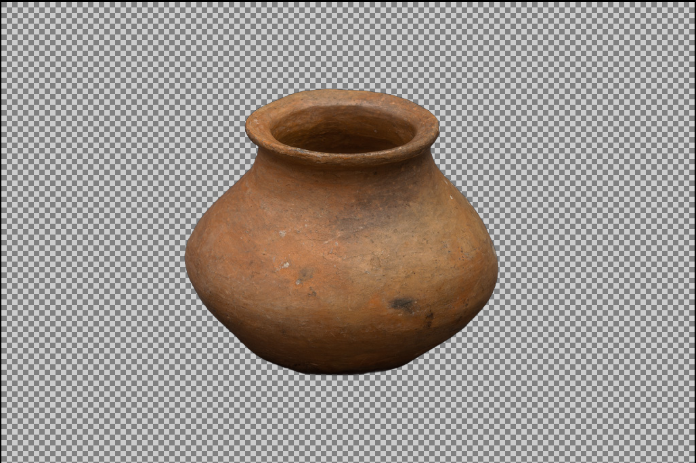

# Tainacan-Based Dataset

This page provides an overview of how we utilized the [Tainacan collection](https://tainacan.museudoindio.gov.br/) to build our dataset, which was later used for fine-tuning our models and analysis.

## Dataset Creation Process

The first step in our workflow is data collection. We accomplish this through a two-stage process:

1. Scraping the data: A [`Bash` script](https://github.com/Luizerko/indigenous_clusters_and_communities/tree/main/tainacan_collection/scrapping_data.sh) is used to extract data from the Tainacan platform.

2. Processing and structuring: A [`Python` script](https://github.com/Luizerko/indigenous_clusters_and_communities/tree/main/tainacan_collection/creating_dataset.py) then processes the raw data and organizes it into a structured CSV format.

Once the dataset is prepared, we proceed with data cleaning and exploratory analysis to assess the volume and distribution of the data, identify key categories and their relationships and explore potential clustering opportunities. For a more in-depth analysis of the dataset, refer to the [Jupyter notebook](https://github.com/Luizerko/indigenous_clusters_and_communities/tree/main/tainacan_collection/dataset_exploration.ipynb).

Below, we provide a high-level summary of the dataset attributes, based on our initial inspection and documentation efforts.

| Attribute Name           | Description                                                                                                                                          |
|-----------------------|------------------------------------------------------------------------------------------------------------------------------------------------------|
| `url`                | Link to the item in Tainacan's archive.                                                                                                           |
| `thumbnail`          | Link to the thumbnail image of the element. `NaN` if there's no image associated with the item.                                                   |
| `creation_date`      | Creation date of the item in Tainacan's archive. This is an internal variable from the platform.                                                   |
| `modification_date`  | Date of the last modification of the item in Tainacan's archive. This is an internal variable from the platform.                                   |
| `numero_do_item`     | String identifying the item. It has multiple formats (e.g., `DD.D.DD`, `DD.D.DDC`, `D`, `DD`, `DDD`, etc.).                                          |
| `tripticos`          | No relevant explanation (`D.DD` or `DD.DD`).                                                                                                        |
| `categoria`          | Category of the item. There are ten different and well-defined categories.                                                                          |
| `nome_do_item`       | Name of the item. Sometimes followed by an observation in parentheses.                                                                            |
| `nome_do_item_dic`   | Name of the item according to a dictionary. A second, more generic name for the item.                                                             |
| `colecao`            | Name of the collection the item belongs to.                                                                                                        |
| `coletor`            | Person or institution responsible for collecting the item.                                                                                         |
| `doador`             | Person or institution responsible for donating the item to the museum.                                                                              |
| `modo_de_aquisicao`  | How the item was acquired: bought, donated, exchanged, other, or unknown.                                                                           |
| `data_de_aquisicao`  | Date when the item was acquired by the museum.                                                                                                      |
| `ano_de_aquisicao`   | Year in which the item was acquired by the museum.                                                                                                 |
| `data_de_confeccao`  | Date when the item was made.                                                                                                                       |
| `autoria`            | Person or institution that made the item. Sometimes includes observations in parentheses.                                                          |
| `nome_etnico`        | Indigenous name of the item. Often includes the noun in quotes and additional information.                                                         |
| `descricao`          | Description of the item, including material, components, and functionality.                                                                      |
| `dimensoes`          | Dimensions of the item.                                                                                                                          |
| `funcao`             | Function of the item.                                                                                                                            |
| `materia_prima`      | Material the item is made of, categorized as 'animal', 'vegetal', 'mineral', or 'sintetico'.                                                     |
| `tecnica_confeccao`  | Techniques used to make the item.                                                                                                                  |
| `descritor_tematico` | Keywords describing themes related to the item.                                                                                                    |
| `descritor_comum`    | Keywords describing generic categories related to the item.                                                                                         |
| `numero_de_pecas`    | Number of pieces for the item, often with a short description of the pieces.                                                                       |
| `itens_relacionados` | List of related items in `numero_do_item` format.                                                                                                  |
| `responsavel_guarda` | Museum responsible for the item.                                                                                                                   |
| `inst_detentora`     | Museum that owns the item (always "Museu do Índio").                                                                                               |
| `povo`               | Community associated with the item.                                                                                                               |
| `autoidentificacao`  | List of communities identified by the original owner as related to the item.                                                                       |
| `lingua`             | Language of the community associated with the item.                                                                                               |
| `estado_de_origem`   | List of Brazilian states associated with the item.                                                                                                |
| `geolocalizacao`     | Specific location where the item originated (e.g., city, community, or other description).                                                        |
| `pais_de_origem`     | Country where the item is from.                                                                                                                    |
| `exposicao`          | Exhibitions where the item was displayed, possibly including the date it was returned to the museum.                                               |
| `referencias`        | Bibliographic references related to the item.                                                                                                      |
| `disponibilidade`    | Accessibility status of the item: inaccessible, locally accessible, or fully accessible.                                                           |
| `qualificacao`       | Additional descriptive information.                                                                                                                |
| `historia_adm`       | Administrative history of the item, including how it was acquired by the museum. May include random related or unrelated information.              |
| `notas_gerais`       | General notes with various information, related or unrelated to the item.                                                                          |
| `observacao`         | Additional observations about the item, often unrelated information.                                                                               |
| `conservacao`        | Conservation state of the item: good, regular, or bad.                                                                                            |
| `image_path`         | Local path to the associated image.                                                                                                               |

## Data Processing

While many analyses were conducted during dataset assembly, additional preprocessing is required to prepare the data for fine-tuning our models. Beyond handling inconsistencies such as formatting issues, missing data, and incorrect data structures, we focus on two key preprocessing steps: background removal for images and text processing.

### Image Background Removal

Although the collection's metadata contains some formatting inconsistencies, the images themselves are generally high-quality and well-processed. The problem, however, lies mostly on the inconsistency of the backgrounds. If they are not removed, the fine-tuned image extractors might group images based on background characteristics rather than item features, leading to poor results.

To mitigate this issue, we made use of a state-of-the-art [open-source background removal pipeline](https://huggingface.co/briaai/RMBG-2.0). This solution includes built-in preprocessing, ensuring images are cropped (or interpolated) to have consistent size and normalized before background removal. Below are examples of the pipeline applied to our collection - images are mapped back to their original sizes before plotting:

  
  

  
  

  
  

  The top row presents a simple example featuring a vase, a single, well-defined item. The middle row, in turn, demonstrates background removal for multiple items, while the bottom row showcases an item with a very complex form. These examples illustrate both the variety of items in the collection and the effectiveness of the background removal pipeline.

---

### Text Processing

The text processing stage focused on preparing item descriptions extracted from the Tainacan collection for downstream modeling. This process initially perfectly preserved the linguistic characteristics of the original texts, such as Portuguese accents and indigenous vocabulary, while standardizing the input simply by converting all text to lowercase. As we dove deeper, however, we faced a few challenges that required targeted preprocessing solutions.

#### Token Limitations and GPU Constraints

Our initial obstacle came from hardware constraints, specifically, running on an RTX 4070 with 8GB of VRAM. Because one of our main training strategies relied on *unsupervised contrastive learning* (more on that on the [clustering documentation](https://github.com/Luizerko/master_thesis/tree/main/docs/CLUSTERING.md)), which benefits from larger batch sizes for generating "negative samples", we needed to limit the number of tokens per description to maintain efficient training. While experimenting, we found that only 856 descriptions (out of ~21K) exceeded 128 tokens. So, truncating inputs to 128 tokens proved a reasonable compromise.

Actually, during training, we could still experiment with slightly longer descriptions thanks to batch sizes of 16 fitting into memory and being a reasonable enough number for our unsupervised method. However, the interpretability pipeline, particularly using *integrated gradients*, were much more memory intensive. Therefore, 128 tokens became our hard upper limit.

  

  Token length distribution of original descriptions. Min: 2 tokens, Max: 420 tokens, Mean: ~57, Std: ~36. Quartiles: Q1 &#8776; 32, Q2 &#8776; 49, Q3 &#8776; 73. Only 856 descriptions exceeded 128 tokens.

#### Semantic Density and Description Overload

Another issue wasn’t just length, but semantic overload. Encoding a long sequence into a single embedding dilutes semantic clarity. Sentence embeddings are not like predicting tokens, they aim to summarize a whole description in one vector. As the length grows and multiple concepts are included, the embedding loses focus. This is also consistent with established benchmarks. Most descriptions in datasets like [*GLUE*](https://huggingface.co/datasets/nyu-mll/glue) and [*extraglue*](https://huggingface.co/datasets/PORTULAN/extraglue) (PT-BR translated version of *GLUE*), for example, stay under 100 tokens, reinforcing that shorter inputs are better for semantic representation.

#### Mixed and Noisy Descriptions

Compounding the preivous issue, the dataset descriptions featured inconsistent patterns. For example:

- Multiple items described in one description (e.g. an item with subitems).
- Stacked edits, where curators added new paragraphs without deleting earlier ones (very much understandable for the archival context in which no information is expendable).
- Descriptions that included historical context or narratives, not just item-specific info.

We naturally abstain from judgment on curatorial decisions, but still needed to reframe the data to make it model-friendly for embedding computations and visualization purposes.

#### Condensing Descriptions with LLMs

To address the above challenges, we implemented a LLM-assisted rewriting pipeline, aiming to reduce each description to no more than 62 tokens (leaving room for a `CLS` and `SEP` token for a total input of 64). We prompted the model to preserve meaning, keywords, and especially indigenous vocabulary. In most cases, the model produced concise paraphrases. For roughly 30% of descriptions, the ones longer than 64 tokens, we observed some light summarization instead of strict paraphrasing. From this point on, we'll refer to all these new descriptions generated by the LLM as "summarized descriptions".

Again due to hardware limits, we leveraged the [Groq API](https://groq.com/) to access powerful open-source models. After manual evaluation of dozens of samples, we selected [Llama-4-Maverick-17B-128E-Instruct](https://huggingface.co/meta-llama/Llama-4-Maverick-17B-128E-Instruct) as the best fit. Because of the free-tier usage limits on input tokens we had for the API, we sticked to chunks of 20 descriptions per request. Also API usage was carefully monitored to stay within request limits per day. Temperature of the model was set to 0.3 for conservative outputs. This value seemed to give us the best balance between accuracy and variability.

Despite occasional errors, especially when we had a series of almost identical descriptions, which could lead the model to skip one or two, we only had to manually correct a very small fraction of results.

  

  Token length distribution after LLM summarization. Most summarized descriptions fell well below the 62-token threshold. A few outliers remain, but overall descriptions were significantly more concise now.

#### Building the Contrastive Dataset

While our first training method on the textual data was *unsupervised contrastive learning*, we also developed a *supervised contrastive dataset* for a second method. The process to build it used the summarized descriptions as input. For each, we prompted the LLM to generate a paraphrase (positive sample) and also select the most semantically different description from the same chunk (negative sample).

Again, the LLM pipeline ran smoothly and required only light manual cleanup. However, we later discovered a subtle issue we haven't thought of earlier: because it didn't matter for condensing descriptions, our chunks were made of sequential data, which sometimes led to grouped similar descriptions (e.g. multiple dolls described similarly). This meant that the negatives the model was outputing weren’t always semantically distinct.

In the end, we decided to use this dataset only as a validation metric and for evaluation (what we called *In-Context STS-B*), so the implications of the issue were very limited. For training, we later constructed a more robust dataset by keeping the positive paraphrases aforementioned and generating negatives by randomly sampling 10 summarized descriptions from items that belonged to a different `categoria`, (almost) always guaranteeing meaningful semantic contrast. The choice of 10 negatives was the best trade-off between diversity and GPU memory limits. Fewer negatives degraded model performance, but more reduced our batch sizes too much. For more detailed methodology and outcomes, refer to the [clustering documentation](https://github.com/Luizerko/master_thesis/tree/main/docs/CLUSTERING.md) once again.