# Visualization Tool  

This page explains how we built our visualization tool. We go over the design choices and implementation, sharing the reasoning behind each step and highlighting the tool’s features. We also discuss its limitations and future improvements.

## The Foundation  

Our tool was built using `Python` and two powerful interactive libraries: `Plotly` and `Dash`. We chose these because our dataset creation, processing, and clustering experiments were all done in `Python`, making integration straight forward.

The system is organized into three main sections, each offering a distinct way to explore the dataset. The first tab presents an interactive view of the data as point clouds, allowing users to explore visual and semantic relationships between items through various projection and filtering tools. The second tab focuses on the temporal dimension of the collection, enabling users to browse the museum's acquisition timeline and analyze how items are distributed across specific years. The third and final tab offers a geographic perspective, displaying the full dataset on a map of Brazil and linking each object and community to its associated location.

   
  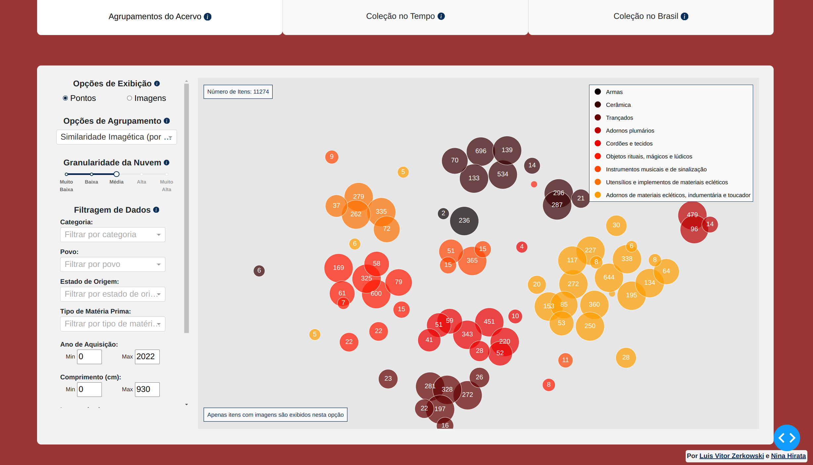
  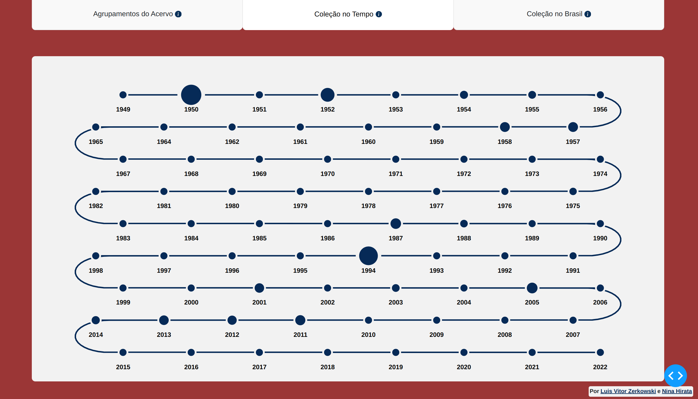
  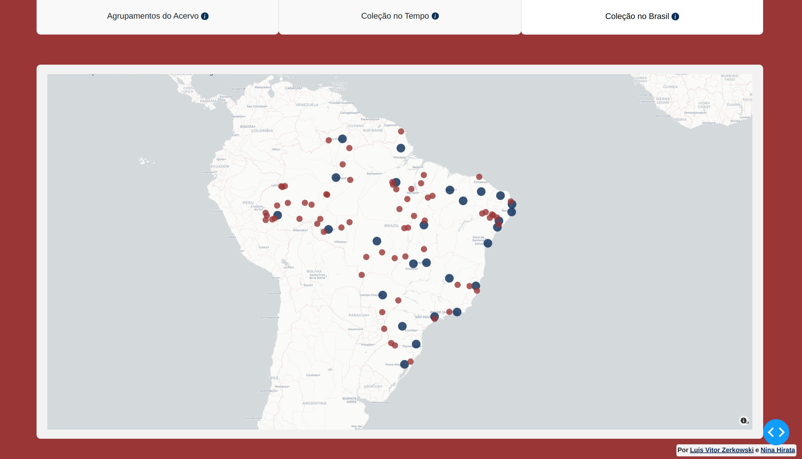
  

    Screenshots of the three primary tabs: (left) the Collection Semantic Space with point-cloud visualizations, (center) the Acquisition Timeline view, and (right) the Geographic Map of Brazil.
  

   

To help users better understand the tool's features, we've also added info buttons throughout the interface. These small buttons are placed next to filters, visual elements, and even at the top of entire tabs. Clicking one opens a short description explaining what the element does, offering quick, in-context guidance wherever it might be needed.

Below, we describe each of these components in more detail.

## Collection Semantic Space and Groupings

This tab presents several point-cloud based visualizations of the dataset. Each point represents an object, and users can choose between two display modes: marker-based - where colors can correspond to different clusters if applicable -  or image-based, where each point is replaced by the object’s actual image.

   
  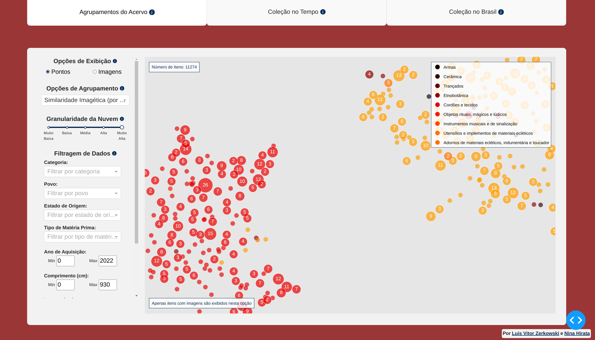
  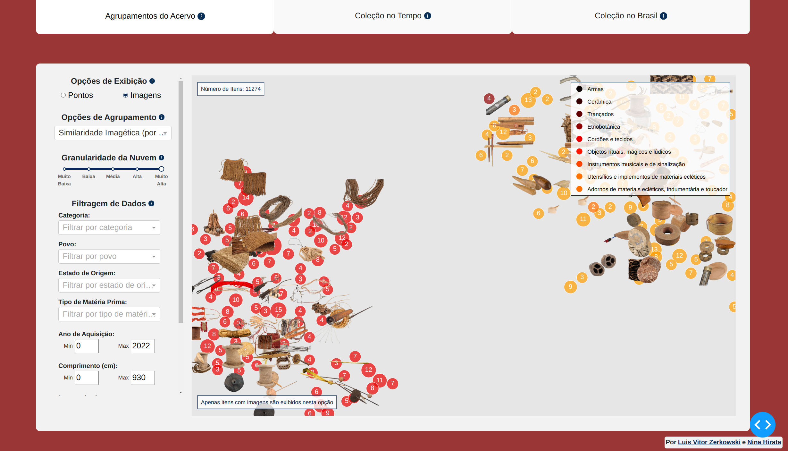
  

    Comparison of point-cloud display modes: (left) markers colored by cluster, and (right) item images replacing markers for a more intuitive visual grouping.
  

   

To ensure smooth performance - especially given the high number of points - we implement lazy loading throughout this tab. Rather than processing and rendering all points at once, the system first determines whether each point is currently visible within the user’s viewport. Only visible points are processed for actions like color assignment, plotting, and interactions. This significantly improves responsiveness and prevents unnecessary computations.

This approach, however, does come with a few trade-offs. For instance, when panning across the canvas, users may briefly see an empty area outside their initial view. The new region's points will load as soon as the mouse button is released, appearing instantly.

In image mode, we went a step further: images are fetched in real time rather than preloaded. Preloading hundreds of images upfront severely impacted interactivity - screens could take up to 25 or 30 seconds to render. Now, as you navigate, images dynamically reload, even for regions you've visited before. While this can result in a brief flicker when dragging around the view, we believe this is a worthwhile trade-off, as it keeps the interface responsive and fluid.

We mention these limitations to be transparent, but in practice, they have minimal impact on the user experience. The overall performance gains and interactivity more than make up for the occasional moment of minimally delayed rendering.

### Collapse Markers

Again due to the large volume of items in the collection, both visualization modes (markers and images) support collapse markers - translucent circles that represent multiple nearby points that can't be individually shown at the current zoom level. When points are too densely packed, plotting them all individually would lead to visual clutter and reduced performance. Instead, we display a larger, semi-transparent circle with a number inside, indicating how many objects are aggregated in that region. The more points within a collapsed group, the larger the circle. This feature not only improves readability, but also enhances performance by avoiding the need to render thousands of overlapping points simultaneously.

We initially implemented collapsing using *DBSCAN*, a density-based clustering algorithm. While it worked reasonably well, *DBSCAN*'s propagation mechanism sometimes grouped together points that were visually far apart, especially in denser regions. This made the collapsed markers feel imprecise or unintuitive in certain areas.

To address this, we transitioned to a more direct and spatially aware method using a *KD-Tree*. We build a *KD-Tree* over all visible points and perform efficient neighborhood searches to determine which points are close enough (based on zoom-normalized Euclidean distance) to be grouped. A distance threshold controls the grouping sensitivity, and small clusters - those with fewer than 5 points - are ignored, as their visual overlap is minimal and doesn't hinder exploration.

This approach produces more natural and intuitive groupings, better aligned with the user’s visual expectations, and while it’s slightly slower than the *DBSCAN* version, it still runs in real time.

### Hovering and Clicking

The marker-based point cloud is fully interactive and designed to support exploration. Depending on whether the user is browsing visual similarities or textual similarities, hovering over a point reveals a tooltip card:

- For visual similarity, the card displays the item’s image.

- For textual similarity, it shows the item's description with highlighted keywords - the terms considered the most relevant for the embedding computation of the item. A small (cropped) image of the object is also shown (if available) to provide a bit more context for the text.

In both cases, the card also includes key metadata: the item’s name, the community it comes from, and the year it was acquired by the museum. Additionally, the corresponding marker is visually emphasized with a subtle shadow and increased size to highlight the hovered item in the point cloud.

   
  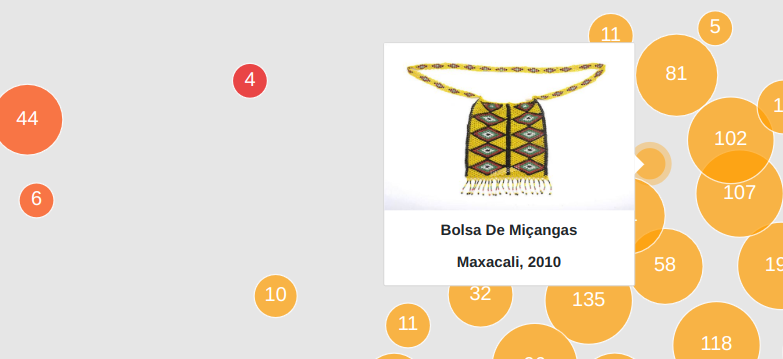
  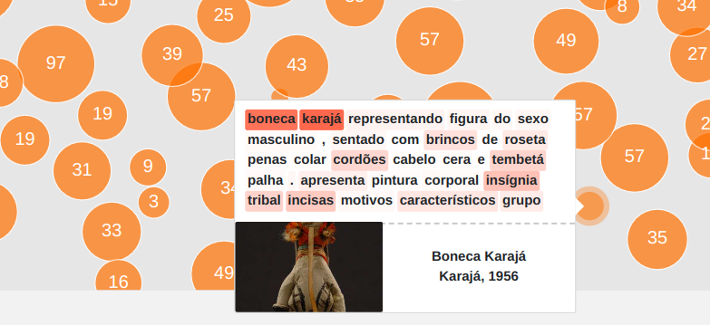
  

    Hover tooltips in point-cloud mode: (left) visual similarity tooltip displaying the full item image, and (right) textual similarity tooltip showing the description with highlighted keywords alongside a thumbnail.
  

   

Clicking on a point opens the corresponding item’s page on the [Tainacan collection](https://tainacan.museudoindio.gov.br/), allowing for deeper inspection of that object.

The image-based point cloud is more straightforward and intentionally less interactive. Its goal is not detailed exploration but rather to provide a visually engaging overview of projected content - allowing users to immediately grasp grouping patterns through the visual density and arrangement of images. This version does not support hovering or clicking. It is intended as a passive, yet impactful, visualization.

### Grouping Options

The visualization tool offers several grouping modes, allowing users to explore the dataset through different semantic lenses.

One of the simplest modes is based on `tipo_de_materia_prima` (material type). This view serves as a baseline and splits the dataset into 7 distinct regions based on whether items are composed of *animal*, *vegetal*, *mineral*, or combinations of these. The regions are laid out in a triangle, with each vertex representing a pure material type. The sides between vertices represent objects composed of two materials (e.g., animal and vegetal), and the center contains objects made from all three. Since all items in a given region share the same material composition, we introduced 2D Gaussian noise to their positions to create a visual spread - turning a flat categorical layout into a more natural point-cloud view.

   
  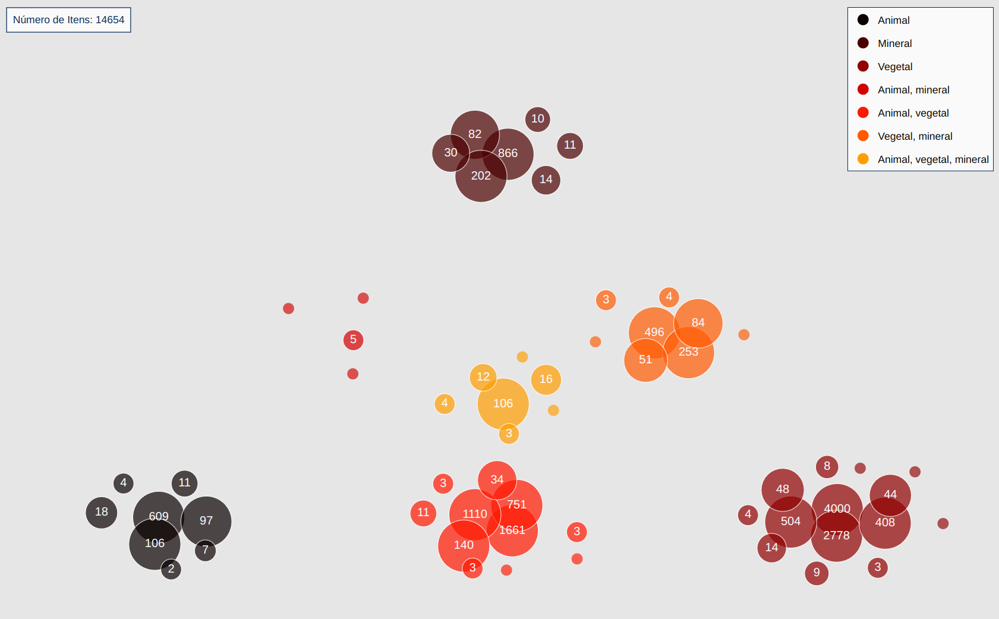
  

    Material composition grouping: objects arranged within a triangle based on primary materials (animal, vegetal, mineral), with 2D noise added for visual spread.
  

   

Next, there are four visual-similarity-based groupings, which come from models trained on the image embedding pipeline. These groupings aim to organize objects based on how they look, capturing patterns in color, shape, texture, and visual detail. More information about how these clusters were generated is available in our [clustering experiments documentation](https://github.com/Luizerko/master_thesis/tree/main/CLUSTERING.md).

These views enable users to browse the collection in a visually intuitive way, follow thematic or stylistic patterns, discover relationships between communities based on shared design elements, or even spot outliers, such as items potentially mislabeled by metadata but correctly clustered based on visual features.

The four visual clustering options differ in how they were trained:

- **Vanilla:** Uses embeddings from a pre-trained model. It provides a general-purpose visual grouping.

- **Multi-head:** Embeddings come from a model trained to predict both `categoria` and `povo` simultaneously. This view reflects a semantically richer space (without any particular cluster) where structure may be influenced by both labels.

- **Single-head (`categoria`):** Embeddings come from a model fine-tuned to predict `categoria`. This produces clear global clusters corresponding to each category, ideal for studying intra or inter-category relationships.

- **Single-head (`povo`):** This model was fine-tuned to predict `povo`. Due to the large number of communities and data imbalance, this view lacks global structure but still reveals local clusters that group items from the same or similar communities. It’s best used when exploring the collection with specific communities in mind.

   
  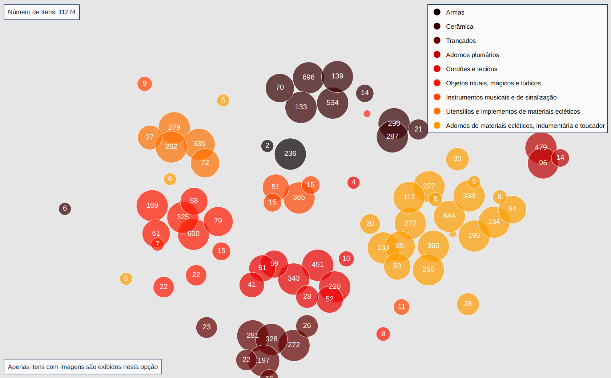
  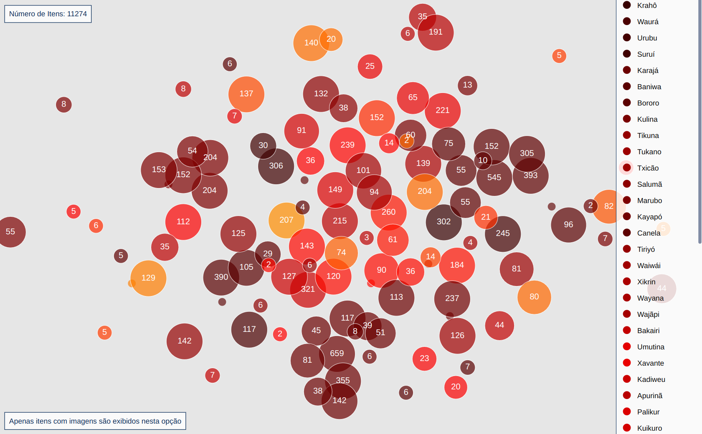

  
  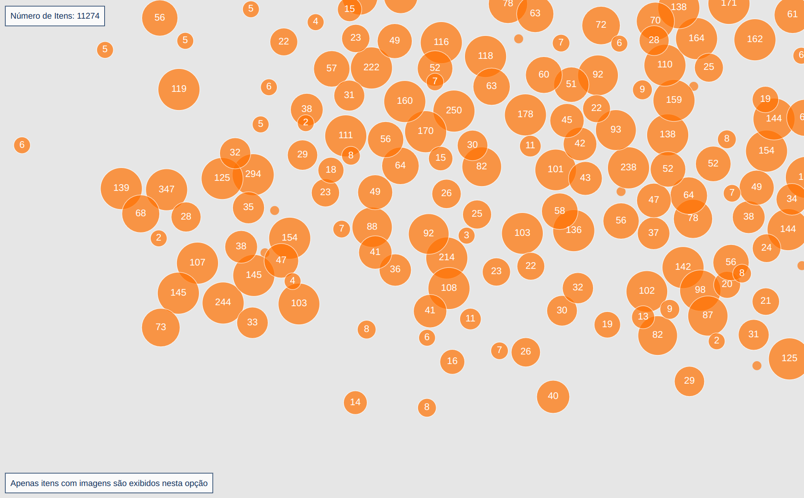
  

    Four visual clustering modes: (top-left) Vanilla; Single-head (categoria); (bottom-left) Single-head (povo); (bottom-right) Multi-head.
  

   

Finally, there are two grouping modes based on textual similarity, using items’ descriptions instead of images. Analogous to the image pipeline, these modes organize objects by their (summarized) descriptions, capturing textual affinities even when items don’t look alike but embody the same concept. This approach also lets us cluster objects for which we have no image (half of the collection), using only their descriptions (with just one item lacking any description). More information about generating these clusters can be found in our [clustering experiments documentation](https://github.com/Luizerko/master_thesis/tree/main/CLUSTERING.md).

The two textual clustering options also differ in how they were trained:

- **Vanilla:** Uses embeddings from a pre-trained model. It provides a general-purpose visual grouping.

- **Contrastive Learning:** Uses embeddings from a contrastively fine-tuned model that pulls semantically similar sentences closer together and pushes different ones farther apart. This creates a representation tailored to our custom-designed dataset of descriptions.

<!-- Images of textual groupings -->

### Point-Cloud Granularity

The granularity slider lets users control how detailed or aggregated the point-cloud appears by adjusting the threshold used for collapsing nearby points.

At low granularity (high threshold), nearby points are grouped into larger clusters, making the visualization easier to navigate and more performant - especially useful when focusing on a smaller region of the space or zooming in deeply. At high granularity (low threshold), points are less aggressively grouped, preserving fine-grained detail and revealing subtle structures across the whole dataset. However, this mode may be heavier on performance, especially when many individual points need to be rendered simultaneously.

  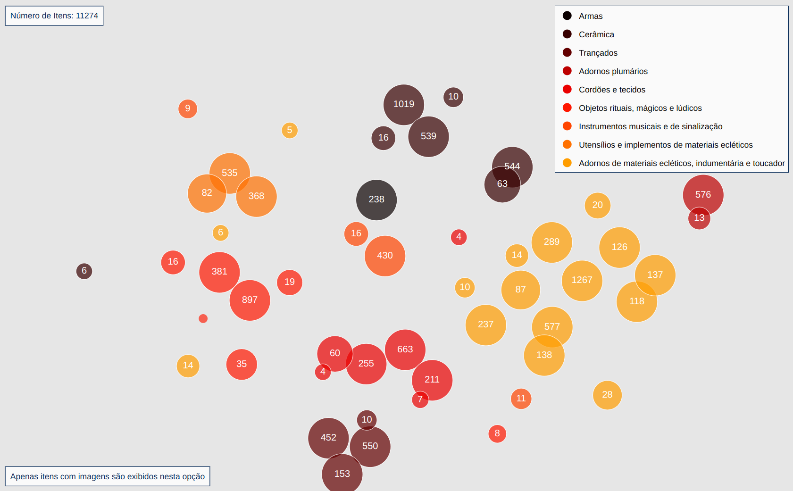
  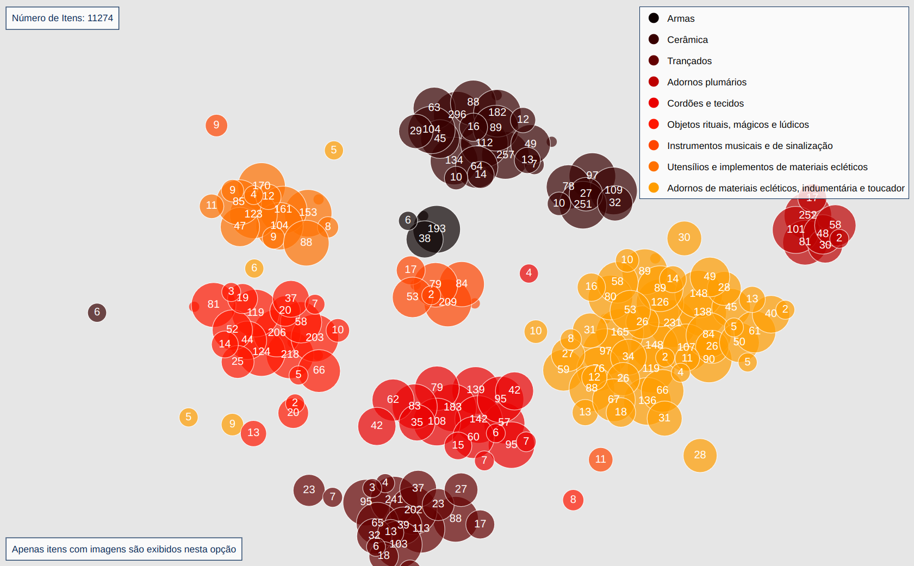
  

    Granularity comparison: (left) low granularity aggregating nearby points into larger clusters, and (right) high granularity revealing individual point detail.
  

   

This feature allows users to balance between performance and visual detail, depending on their exploration goals.

### Filtering

The visualization tool includes powerful filtering options that let users focus on specific subsets of the collection. Users can filter the dataset by multiclass filters - `categoria`, `povo`, `estado_de_origem`, `tipo_de_materia_prima` - or by range-based filters (min and max values) - `ano_de_aquisicao`, `comprimento`, `largura`, `altura`, `diametro`. Notice that a value of 0 in any range filter is treated as “unknown” or missing data.

To provide immediate feedback, a small rectangle in the top-left corner of the interface shows the number of items remaining after filtering. This helps users stay aware of the scope of their current selection. If no filters are applied, the visualization shows all items available for the selected grouping mode.

  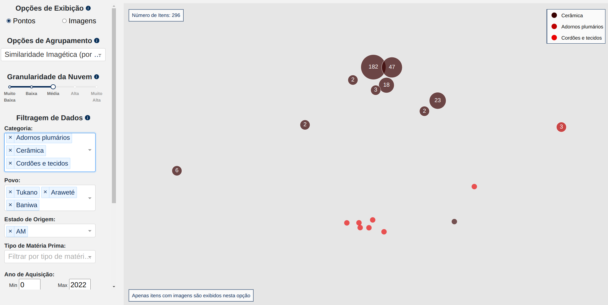
  

    Filter panel with multiclass filters selected, and the top-left corner of the graph showing remaining items after filtering.
  

   

This filtering system enables targeted exploration of the dataset and allows users to investigate patterns in material, form, time, or geography within any chosen (grouping) embedding space.

## Collection's Timeline

This tab allows users to explore the collection through a temporal lens, offering a dynamic way to investigate how the museum's acquisitions evolved over time. It highlights when items entered the collection and gives users insight into distinct periods for the museum - revealing the intensity of acquisitions, key collectors or collections, and broader historical or institutional patterns.

The timeline tab is split into two main parts: an interactive timeline overview and a detailed yearly breakdown. Each provides a different perspective on the archive's temporal structure.

### Zig-Zag Timeline

The first view presents a zig-zag timeline, where each marker represents a year in which the museum acquired items. The position of the markers forms a zig-zag layout for better visual spacing, and the size of each marker is computed based on the number of items acquired that year - larger markers signal more acquisitions.

  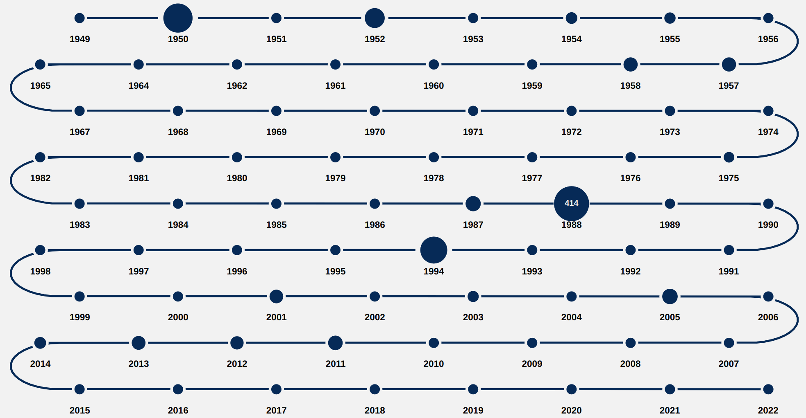
  

    Zig-zag timeline view: yearly acquisition markers sized by count, with hover highlighting a selected year.
  

   

When you hover over a marker, it subtly enlarges to highlight the year. Clicking on a marker takes the user to the year distribution view for that specific year, providing a closer look at the acquisitions made during that period.

### Year Distribution

The second part of the tab provides a detailed view of a specific year, designed to give users a month-by-month breakdown of item acquisition.

  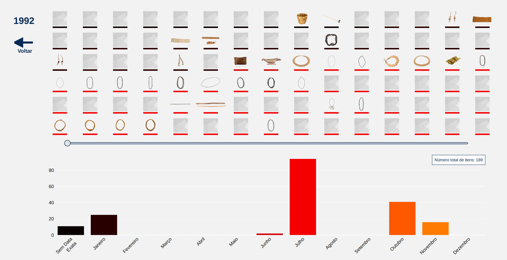
  

    Yearly breakdown view: grid of item thumbnails color-coded by acquisition month, paired with a monthly histogram below.
  

   

At the top-left, the selected year is displayed alongside a back button, allowing users to return to the zig-zag timeline and choose another year.

One of the main elements is a grid of item thumbnails, sorted chronologically by their acquisition date. Items with a known date are arranged accordingly, while those with only a known year appear first (as *no specific date* items). Below each thumbnail is a colored line, part of a gradient that visually encodes the month of acquisition. These lines are connected directly to a histogram (bar plot) beneath the grid, the other main element, which shows the number of items acquired in each month of that year, along with a bar for those items that have no exact date.

The interface supports rich interactivity:

- Hovering over an item line highlights that item by enlarging its thumbnail, adding a border in the same color as the month gradient, and dimming all other items for focus. A tooltip also appears with detailed metadata: the item's name, exact acquisition date (if available), its community, the collection it belongs to (if any), and the name of the collector or donor (if applicable).

- Hovering over a bar in the histogram shows the exact quantity of items acquired on that month and highlights all these items on the grid using the same visual effect (larger image, border), but this time applies it to all relevant items. Other items in the grid fade out to allow better focus on the selected month. No tooltip is shown in this case, since the selection involves multiple items. There’s also a bar for items with no exact date, allowing those to be explored and highlighted similarly.

  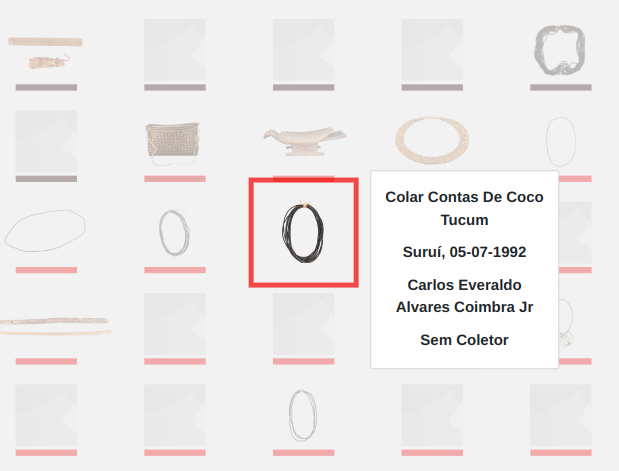
  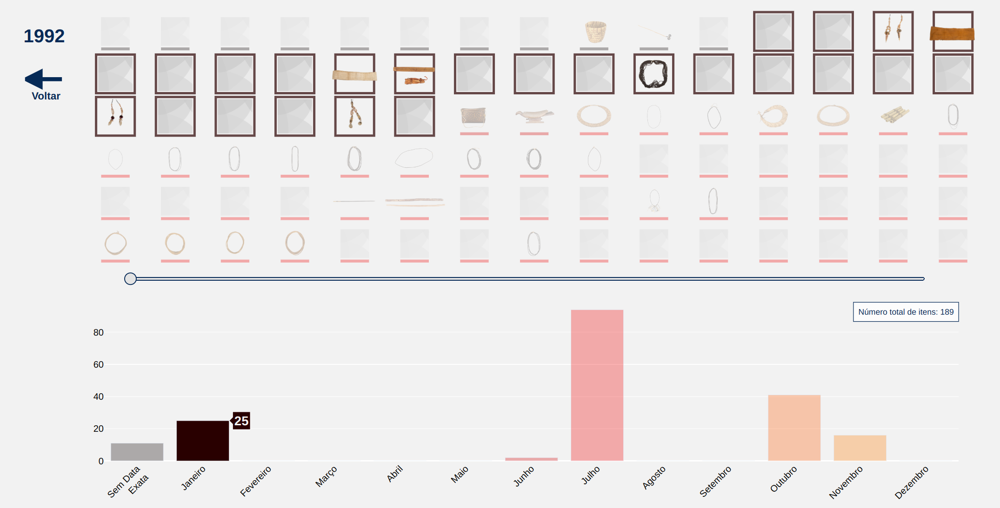
  

    Interactive highlights: (left) the hovered item thumbnail on the grid, and (right) the highlighted month bar with all corresponding items emphasized.
  

   

- There’s also a slider to navigate between pages of the image grid. This widget is crucial because displaying all items on a single grid at once shrinks the visualizations to an unreadable size (we can barely distinguish items or colors in years with many acquisitions) and compromises the app’s interactivity (rendering so many items simultaneously often caused crashes). All hover interactions are naturally scoped to the specific page the user is viewing.

This layout offers users a compelling way to navigate through time, identify patterns in acquisition, and explore how specific years and months shaped the collection as it stands today.

## Collection on Brazil

This tab provides a geographic visualization of the collection across Brazil, allowing users to explore where different items and communities are located throughout the country. The map displays two types of interactive markers:

- Red markers represent specific indigenous communities. Each one is placed at the center of the community’s territory, and when clicked, reveals all items in the collection attributed to that community.

- Blue markers are broader. They represent Brazilian states and aggregate items from all communities located within that state. These markers are placed either at the state capital or roughly at the geographic center of the state.

Hovering over any marker displays its name - either the name of the community (for red markers) or the state (for blue markers) - providing quick geographic context.

  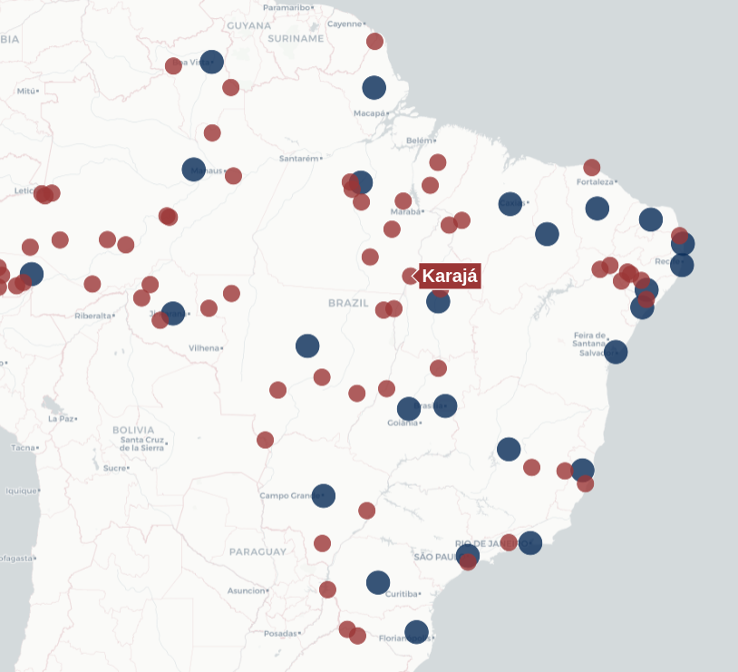
  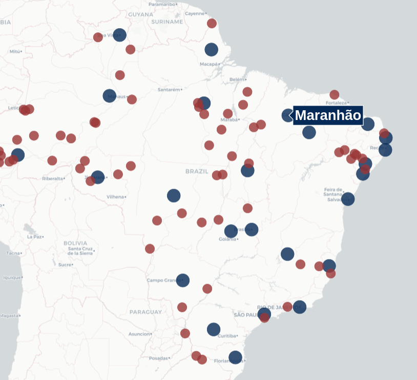
  

    Geographic view: red markers for individual communities and blue markers for states, illustrating the spatial distribution of collection items.
  

   

Ideally, only red markers would be needed, offering precise localization of each community. However, due to challenges in indigenous data organization and standardization, this wasn’t fully possible. While Brazil has many experts and institutions dedicated to Indigenous studies, there is currently no centralized and structured national database mapping every known community to a fixed location. To work around this, we used the (territory demarcation map data)[https://mapa.socioambiental.org/pages/?lang=pt-br] from the (Instituto Socioambiental (ISA))[https://www.socioambiental.org/] - widely regarded as the most comprehensive source for indigenous territory information in Brazil.

That said, not all territories could be mapped directly to specific communities. In many cases, a single territory encompasses multiple communities, or the territory is named differently than the community it includes. To avoid incorrect associations, we only assigned a community to a red marker when the territory demarcation matched the community name directly. As a result, we were able to map only about 40% of the communities with confidence. To ensure full data coverage, we introduced the blue state markers as a fallback, allowing users to still explore items from communities that could not be precisely geolocated.

### Interaction and Browsing

Clicking on any marker (red or blue) opens a modal window listing all the items associated with that marker. The modal begins by indicating the total number of items accessible through that marker and then displays the items in cards organized in a structured grid. Each card includes the item's image, the item's name, the community, acquisition year and a small information button to reveal a short item description.

  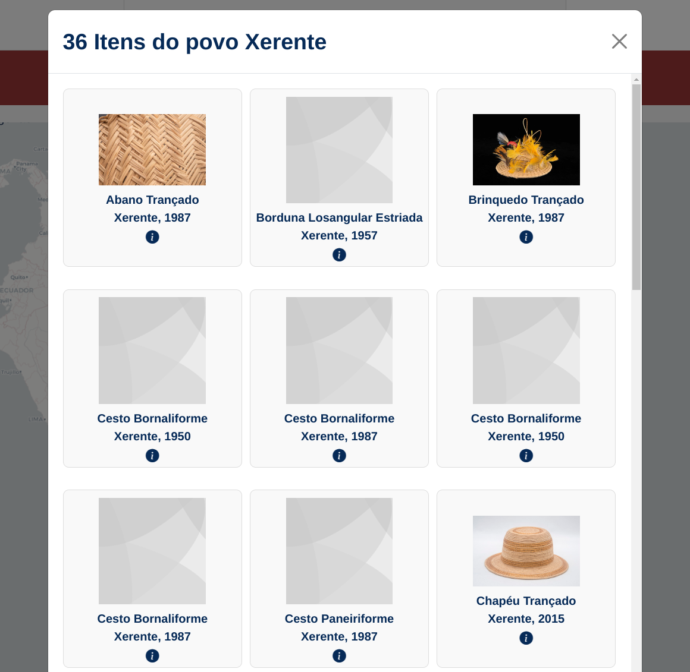
  

    Item modal view: paginated grid of item cards with images, metadata, and info buttons, showing all items related to a selected marker.
  

   

The layout supports up to 3 items per row, with a maximum of 99 items per page (33 rows). If more than 99 items are present, buttons on the bottom of the modal allow users to browse through additional pages. To ensure a smooth and real-time experience, we implemented this pagination combined with image lazy loading. This allows the interface to remain fast and interactive even when browsing large collections tied to a single marker.

This map-based view adds another dimension to the collection, connecting items to their geographic origins and offering yet another valuable way to explore how different regions and communities are represented in the museum's archive.