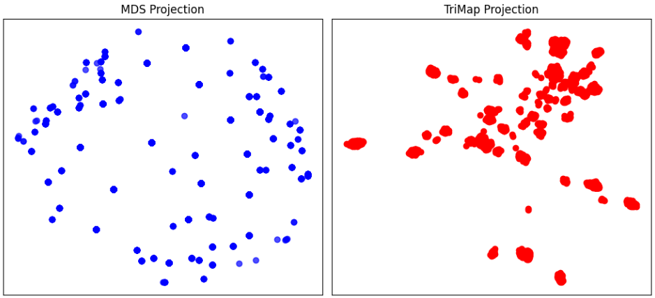
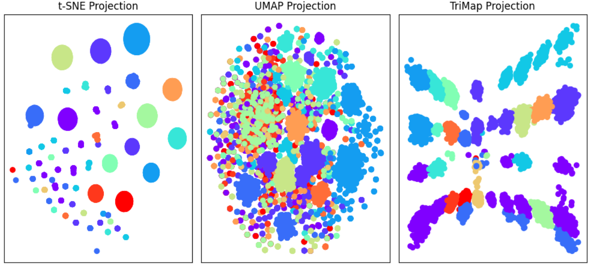
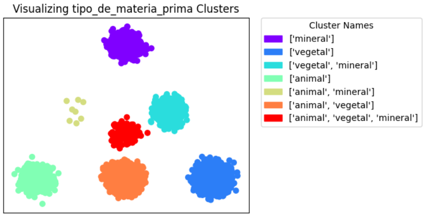

# Clustering Experiments

This page explains all the clustering experiments we conducted, from basic baselines to more complex grouping computations. Here, you will find details on all the methods we implemented, what worked well, and what didn’t.

## The Baselines

Before diving into advanced machine learning techniques, we first analyzed the fundamental aspects of our data. What insights can we extract directly from the dataset? What knowledge can we incorporate from our museum specialists? Understanding this is crucial because, at some point, we need to compare our sophisticated clusters to simpler baselines to evaluate their usefulness. This goes beyond measuring how well an embedding space spreads data or how effective a clustering algorithm is.

### Random Orthonormal Projections

To establish these baselines, we explored multiple approaches. We began by selecting a few categorical features that were easy to cluster by and combined them into a higher-dimensional space for clustering. However, while categorical features are easy to group, we had to be careful not to assume any inherent relationships between different categories. Some of these features lack hierarchy or taxonomy, meaning the clusters should be treated as equidistant from each other. This issue becomes even more pronounced when combining multiple categorical features, as we cannot assume underlying relationships.

To enable clustering while preserving equidistance, we experimented with a **random orthonormal projection** approach. For each feature, we generated a random orthonormal matrix where both rows and columns matched the number of categories in that feature. Since all vectors were orthogonal unit vectors, we ensured they remained equally distant from one another. This method also worked for features that allowed multiple categories, as we could simply sum the vector representations of these multiple categories to get the final representation of a datapoint. Once we generated these vector representations, we concatenated them for each datapoint, creating high-dimensional vectors ready for clustering.

While this idea seemed promising, it failed drastically. The resulting space was highly sparse, making it unsuitable for both clustering and visualization. Even before applying clustering methods, we attempted to project the high-dimensional points into a lower-dimensional space for visualization. Regardless of the projection method, we observed poor point-cloud distributions with no clear clusters or symmetry, preventing the equidistance property from holding effectively.

To try and guarantee the distance property we were interested in, the two projection techniques we experimented with were:

- **MDS**: This method works well in low-dimensional spaces, so it should be fine when we only used 14 dimensions: 10 categories from the `categoria` feature and 4 from the `tipo_de_materia_prima` feature. And since MDS optimizes for distance preservation, it was theoretically a good fit for maintaining equidistance in a 2D projection.

- **TriMap**: We also tested TriMap due to its ability to handle higher-dimensional spaces while preserving global structure, an ideal property for equidistance.

Despite these efforts, the results were still far from ideal. TriMap performed slightly better than MDS, but neither method produced the desired clustering structure.

     
    

    Plot showing MDS and TriMap 2D projections from random orthonormal vectors for 2 features (14 dimensions).
     

### Categorical Clustering  

After the failed experiments with random orthogonal projections, we decided to return to the basics and use direct **categorical clustering**. To do this, we adapted features that allowed multiple category assignments using multi-hot encoding - essentially creating binary features for each possible category within the original feature.  

From there, we simply concatenated these features into a vector for each datapoint and applied **K-Modes**, an algorithm similar to K-Means but designed for categorical data. Instead of using Euclidean distances, K-Modes calculates the number of mismatches between categorical values across different points.  

Using `categoria` and `tipo_de_materia_prima` again, we analyzed the elbow curve and determined that 16 clusters provided the best balance - avoiding both excessive fragmentation and oversimplification. This number is interesting because it is only slightly larger than the sum of the individual category counts of both features. This suggests that it is not an overestimation but rather accounts for possible correlations between certain categories across the two features.

This time, while the representation of each datapoint remained sparse, the categorical clustering method prevented issues with cluster assignment. However, visualization remained problematic.  

- **t-SNE** failed drastically, generating an unusual pattern of well-defined circular point sets. This likely occurred because t-SNE minimizes the KL-Divergence between distributions in high and low dimensions. Given that our high-dimensional space is categorical, t-SNE created a similar projection, resulting in a sparse and disjointed representation.

- **UMAP** also failed, likely due to our sparse space violating the assumption of an underlying high-dimensional manifold. The result was a dense and chaotic cloud of points, with only a few concentrated clusters emerging from the confusion.

- **TriMap** performed better than the other two. On one hand, it managed to create more identifiable clusters, and on the other, it spread clusters of the same color across multiple areas of the plot. While splitting clusters might seem undesirable, it is actually necessary to maintain equidistance in 2D for more than 3 categories - some categories need to appear in multiple places so that their cloud points remain equally distant from others. However, despite this relatively better performance, the visualization was still unclear, and the method clearly struggled with the data.  

     
    

    Plot showing t-SNE, UMAP and TriMap 2D projections from categorical vectors for 2 features (14 dimensions).
     

### Basic Feature-Based Clustering  

Due to the failures of the previous methods, we decided to take an even more fundamental approach, using only the most well-defined and easily visualized features of our data as baselines. Below, we outline the chosen features:  

- **`tipo_de_materia_prima`**: This feature contains three meaningful categories - *animal*, *vegetal*, and *mineral*. Although a fourth category (*sintetico*) exists, no data points fall into this group. Additionally, items can belong to multiple categories.  

    To represent clusters in 2D, we used a triangle representation:

    - Each vertex represents one category (*animal*, *vegetal*, or *mineral*).

    - Midpoints between vertices represent items that belong to two categories.

    - Items that belong to all three categories are placed in the center of the triangle.  

    Since each category would otherwise be represented as a single point in space, making visualization difficult, we added 2D Gaussian noise to create a point-cloud effect.  

    

         
        
    

    

        Plot showing clusters of <i>tipo_de_materia_prima</i>.
         
    

- **`dimensoes`**:

### Specialist Taxonomy

