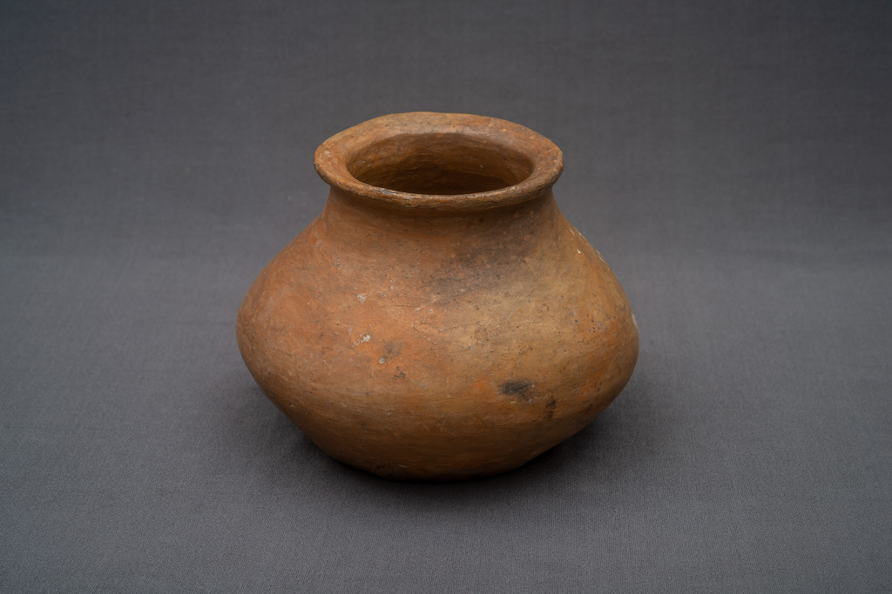
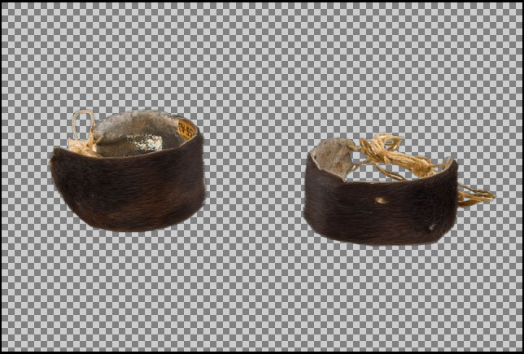
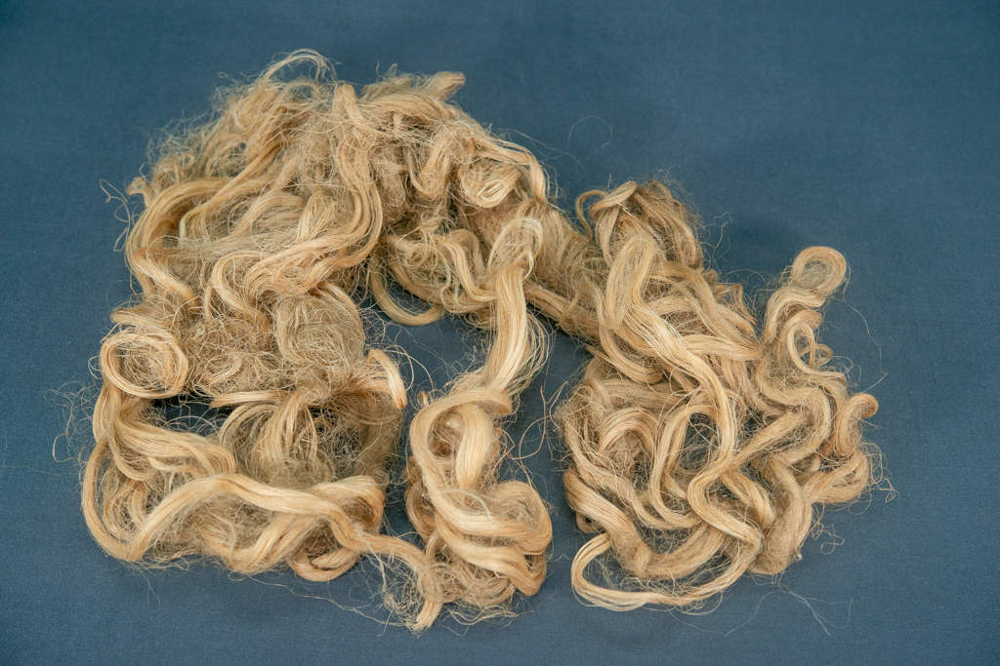

# Tainacan-Based Dataset

This page describes how we used the [Tainacan collection](https://tainacan.museudoindio.gov.br/) to create our dataset and develop our tool.

## Creating the Dataset

Before starting any activity, we need to collect the data. To do this, we first use a [bash script](https://github.com/Luizerko/master_thesis/tree/main/indigenous_project/tainacan_collection/scrapping_data.sh) to scrape data from the Tainacan platform, followed by a [Python script](https://github.com/Luizerko/master_thesis/tree/main/indigenous_project/tainacan_collection/creating_dataset.py) to organize it into a CSV format. With this quick setup, we can start exploring the dataset to understand the amount of data, how it’s distributed across different categories, the connections between columns, and potential ways to group the data effectively.

For a deeper dive into this exploration, check out this [Jupyter Notebook](https://github.com/Luizerko/master_thesis/tree/main/indigenous_project/tainacan_collection/dataset_exploration.ipynb). In here, however, we only provide a general summary of the documentation created for each column of the dataset based on the analyses:

| Column Name           | Description                                                                                                                                          |
|-----------------------|------------------------------------------------------------------------------------------------------------------------------------------------------|
| `url`                | Link to the object in Tainacan's archive.                                                                                                           |
| `thumbnail`          | Link to the thumbnail image of the element. `NaN` if there's no image associated with the object.                                                   |
| `creation_date`      | Creation date of the object in Tainacan's archive. This is an internal variable from the platform.                                                   |
| `modification_date`  | Date of the last modification of the object in Tainacan's archive. This is an internal variable from the platform.                                   |
| `numero_do_item`     | String identifying the item. It has multiple formats (e.g., `DD.D.DD`, `DD.D.DDC`, `D`, `DD`, `DDD`, etc.).                                          |
| `tripticos`          | No relevant explanation (`D.DD` or `DD.DD`).                                                                                                        |
| `categoria`          | Category of the item. There are ten different and well-defined categories.                                                                          |
| `nome_do_item`       | Name of the object. Sometimes followed by an observation in parentheses.                                                                            |
| `nome_do_item_dic`   | Name of the item according to a dictionary. A second, more generic name for the object.                                                             |
| `colecao`            | Name of the collection the item belongs to.                                                                                                        |
| `coletor`            | Person or institution responsible for collecting the item.                                                                                         |
| `doador`             | Person or institution responsible for donating the item to the museum.                                                                              |
| `modo_de_aquisicao`  | How the item was obtained: bought, donated, exchanged, other, or unknown.                                                                           |
| `data_de_aquisicao`  | Date when the item was acquired by the museum.                                                                                                      |
| `ano_de_aquisicao`   | Year in which the item was acquired by the museum.                                                                                                 |
| `data_de_confeccao`  | Date when the item was made.                                                                                                                       |
| `autoria`            | Person or institution that made the item. Sometimes includes observations in parentheses.                                                          |
| `nome_etnico`        | Indigenous name of the item. Often includes the noun in quotes and additional information.                                                         |
| `descricao`          | Description of the object, including material, components, and functionality.                                                                      |
| `dimensoes`          | Dimensions of the object.                                                                                                                          |
| `funcao`             | Function of the object.                                                                                                                            |
| `materia_prima`      | Material the object is made of, categorized as *animal*, *vegetal*, *mineral*, or *sintetico*.                                                     |
| `tecnica_confeccao`  | Techniques used to make the item.                                                                                                                  |
| `descritor_tematico` | Keywords describing themes related to the item.                                                                                                    |
| `descritor_comum`    | Keywords describing generic categories related to the item.                                                                                         |
| `numero_de_pecas`    | Number of pieces for the item, often with a short description of the pieces.                                                                       |
| `itens_relacionados` | List of related items in `numero_do_item` format.                                                                                                  |
| `responsavel_guarda` | Museum responsible for the item.                                                                                                                   |
| `inst_detentora`     | Museum that owns the item (always "Museu do Índio").                                                                                               |
| `povo`               | Community associated with the item.                                                                                                               |
| `autoidentificacao`  | List of communities identified by the original owner as related to the item.                                                                       |
| `lingua`             | Language of the community associated with the item.                                                                                               |
| `estado_de_origem`   | List of Brazilian states associated with the item.                                                                                                |
| `geolocalizacao`     | Specific location where the item originated (e.g., city, community, or other description).                                                        |
| `pais_de_origem`     | Country where the item is from.                                                                                                                    |
| `exposicao`          | Exhibitions where the item was displayed, possibly including the date it was returned to the museum.                                               |
| `referencias`        | Bibliographic references related to the item.                                                                                                      |
| `disponibilidade`    | Accessibility status of the item: inaccessible, locally accessible, or fully accessible.                                                           |
| `qualificacao`       | Additional descriptive information.                                                                                                                |
| `historia_adm`       | Administrative history of the item, including how it was acquired by the museum. May include random related or unrelated information.              |
| `notas_gerais`       | General notes with various information, related or unrelated to the item.                                                                          |
| `observacao`         | Additional observations about the item, often unrelated information.                                                                               |
| `conservacao`        | Conservation state of the item: good, regular, or bad.                                                                                            |
| `image_path`         | Local path to the associated image.                                                                                                               |

## Processing the Dataset

Although many analyses were done while assembling the dataset, there’s still a lot of work needed to standardize the columns and prepare them for clustering. Several adjustments were made to deal with inconsistent formatting, missing data, and incorrect use of data structures (you can find more details once again in the [Jupyter Notebook](https://github.com/Luizerko/master_thesis/tree/main/indigenous_project/tainacan_collection/dataset_exploration.ipynb)). Here, however, we focus on the biggest and most important processing steps that are crucial for clustering and visualization later on.

### Image Background Removal

The collection's metadata might have some formatting issues, but the images are generally high-quality and well-processed. Their neutral backgrounds make object extraction easier, though the background colors vary - some are white, others black, for example - depending on external factors like when the photo was taken. If we don’t remove these backgrounds, our models might group images based on the background instead of their content, leading to artificial clustering results.

To solve this, we used an [open-source pipeline for background removal](https://huggingface.co/briaai/RMBG-2.0). Their code already included preprocessing, normalizing images and guaranteeing they have the same size before removing background. Here are some examples of the segmentation applied to our collection (mapping back to the original image sizes):

  
  

  
  

  
  

  <b>Figure 1:</b> In the upper row, we can a see a simple example with a vase, a single object and with very well-defined form. In the middle row, in turn, we can see an example with multiple objects. Finally, in the lower row, we can see an example with an object that doesn't have a well-defined form. These were selected to show both a bit of the variety of objects we can find in the collection and also to show how well the pipeline works.

